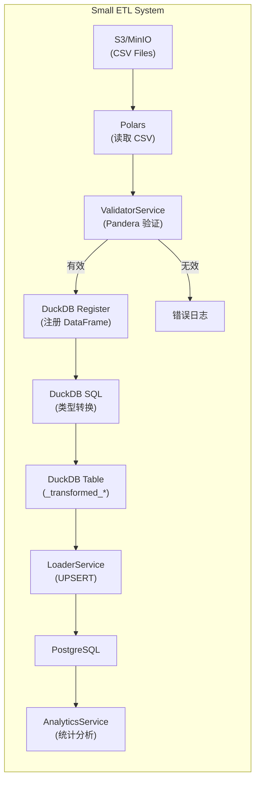
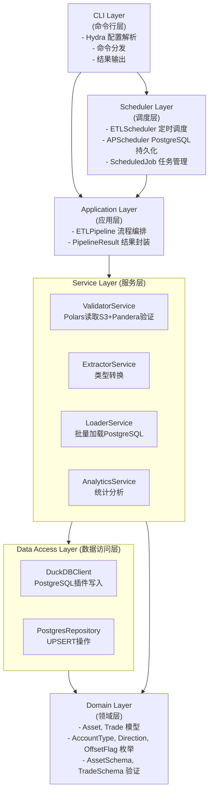
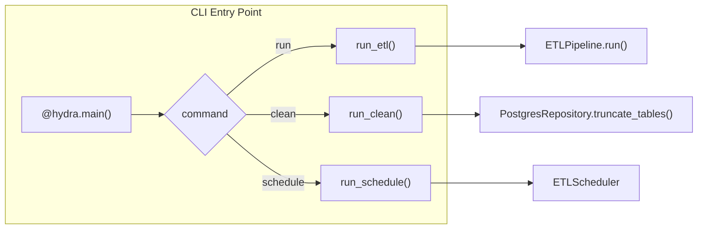
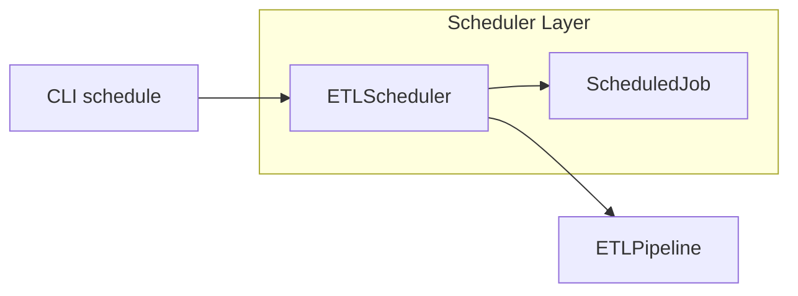
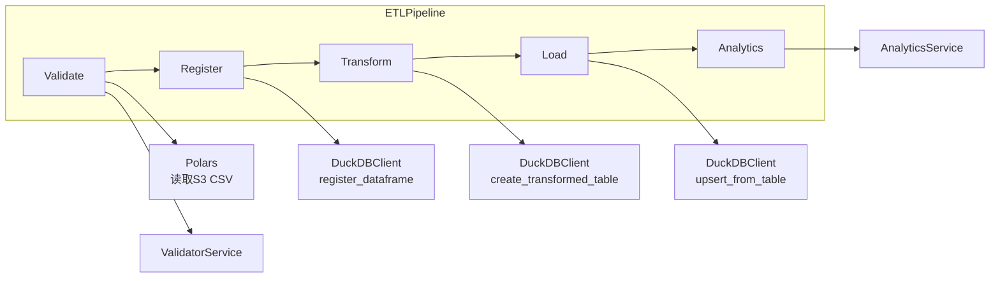
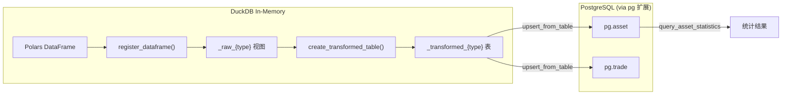
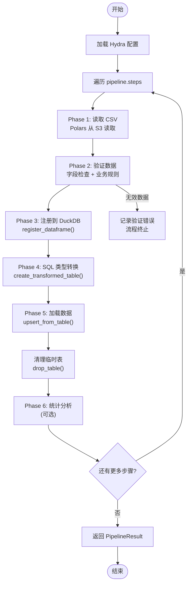
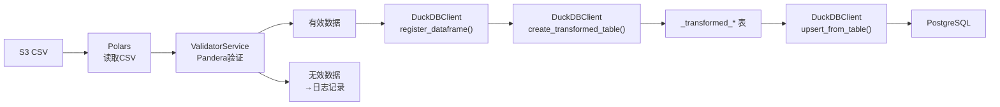

# 架构设计文档

## 1. 系统概览

Small ETL 是一个批量数据 ETL 系统，用于将 S3 CSV 文件中的资产和交易数据同步到 PostgreSQL 数据库，并提供数据验证和统计分析功能。

### 1.1 系统架构图



### 1.2 技术栈

| 层级 | 技术选型 | 用途 |
|------|----------|------|
| CLI | Hydra | 命令行配置与参数解析 |
| 任务调度 | APScheduler | 定时任务管理（PostgreSQL持久化） |
| 数据源 | MinIO/AWS S3 | CSV 文件存储 |
| 数据处理 | DuckDB + Polars | 内存数据转换、列式处理 |
| Schema验证 | Pandera | DataFrame 验证规则定义 |
| 目标数据库 | PostgreSQL | 持久化存储 |
| ORM/Schema | SQLModel | 数据模型定义 |
| 数据库迁移 | Alembic | Schema 版本管理 |
| 配置管理 | Hydra | 多环境配置管理 |
| 包管理 | pixi | 依赖和环境管理 |
| 测试框架 | pytest | 单元测试和集成测试 |
| 类型检查 | Pyright, Pyrefly | 静态类型检查 |
| 代码规范 | Ruff | Linting 和格式化 |

## 2. 分层架构

### 2.1 架构层次



### 2.2 各层职责

#### CLI Layer (命令行层)
- **Hydra 配置解析**: 使用 `@hydra.main` 装饰器自动加载配置
- **命令分发**: 根据 `command` 配置调用不同的 Pipeline 方法
- **配置覆盖**: 支持通过 Hydra 语法覆盖配置（如 `db=test`、`etl.batch_size=5000`）
- **结果输出**: 格式化输出执行结果和统计信息

#### Scheduler Layer (调度层)
- **ETLScheduler**: 基于 APScheduler 的定时任务调度器，支持 PostgreSQL 持久化
- **ScheduledJob**: 定时任务定义，包含任务ID、命令、调度规则
- **任务管理**: 支持添加、移除、暂停、恢复、列出定时任务
- **任务持久化**: 使用 SQLAlchemyJobStore 将任务存储在 PostgreSQL
- **调度模式**: 支持阻塞式（BlockingScheduler）和后台（BackgroundScheduler）运行

#### Application Layer (应用层)
- **ETLPipeline**: ETL 流程编排，支持完整流程或单独运行 assets/trades
- **PipelineResult**: 封装执行结果，包含验证结果、加载结果和统计信息
- 上下文管理器支持，自动资源清理

#### Service Layer (服务层)
- **ValidatorService**: 使用 Polars 读取 S3 CSV，通过 Pandera 验证数据合法性，返回 ValidationResult
- **ExtractorService**: 将 DataFrame 注册到 DuckDB，使用 SQL 进行类型转换，返回 DuckDB 表名
- **LoaderService**: 从 DuckDB 表加载数据到 PostgreSQL，使用 `upsert_from_table` 方法
- **AnalyticsService**: 通过 DuckDB 查询 PostgreSQL 中的已入库数据进行统计分析

#### Data Access Layer (数据访问层)
- **DuckDBClient**: 内存数据库操作，DataFrame 注册，SQL 转换，PostgreSQL 附加，UPSERT 操作
- **PostgresRepository**: 数据库操作（表清空等）

#### Domain Layer (领域层)
- **数据模型**: Asset, Trade (SQLModel)
- **枚举类型**: AccountType, Direction, OffsetFlag (IntEnum)
- **验证Schema**: AssetSchema, TradeSchema (Pandera DataFrameModel)
- **DataTypeRegistry**: 数据类型配置注册中心，支持扩展新数据类型

## 3. 核心组件设计

### 3.1 CLI 组件



#### 3.1.1 命令行接口设计

**入口模块:** `src/small_etl/cli.py`

CLI 使用纯 Hydra 配置（无 argparse），所有参数通过 Hydra 覆盖语法传递。

**支持的命令（通过 `command=` 配置）:**

```bash
# 完整 ETL 流程（默认）
pixi run python -m small_etl

# 清空数据表
pixi run python -m small_etl command=clean

# 定时任务管理
pixi run python -m small_etl command=schedule job.action=start|add|list|remove|pause|resume
```

**Hydra 配置覆盖:**

| 覆盖示例 | 说明 |
|----------|------|
| `db=test` | 使用测试环境数据库配置 |
| `db.host=192.168.1.100` | 覆盖数据库主机 |
| `db.port=5432` | 覆盖数据库端口 |
| `etl.batch_size=5000` | 覆盖批处理大小 |
| `s3.bucket=my-bucket` | 覆盖 S3 bucket |
| `command=clean` | 执行清理命令 |
| `job.action=add` | Schedule 子命令 |
| `job.id=daily_etl` | Schedule 任务 ID |

#### 3.1.2 接口定义

```python
@hydra.main(version_base=None, config_path="../../../configs", config_name="config")
def main(cfg: DictConfig) -> int:
    """CLI 入口函数，返回退出码"""
    ...

def run_etl(cfg: DictConfig) -> int:
    """执行 ETL Pipeline"""
    ...

def run_clean(cfg: DictConfig) -> int:
    """清空数据表"""
    ...

def run_schedule(cfg: DictConfig) -> int:
    """执行调度器命令"""
    ...

def print_result(result: PipelineResult) -> None:
    """格式化输出执行结果"""
    ...
```

#### 3.1.3 使用示例

```bash
# 运行 ETL（默认命令）
pixi run python -m small_etl

# 使用测试环境配置
pixi run python -m small_etl db=test

# 覆盖多个配置
pixi run python -m small_etl db.host=192.168.1.100 etl.batch_size=5000

# 清空数据表
pixi run python -m small_etl command=clean
pixi run python -m small_etl command=clean db=test
```

#### 3.1.4 退出码

| 退出码 | 含义 |
|--------|------|
| 0 | 成功 |
| 1 | 一般错误 |

#### 3.1.5 clean 命令

`clean` 命令用于清空数据库中的 asset 和 trade 表，方便测试时重置数据。

**使用示例:**

```bash
# 清空开发环境数据
pixi run python -m small_etl command=clean

# 清空测试环境数据
pixi run python -m small_etl command=clean db=test

# 清空指定数据库
pixi run python -m small_etl command=clean db.host=192.168.1.100 db.database=mydb
```

### 3.2 Scheduler 组件



#### 3.2.1 ETLScheduler (调度器)

**职责:**
- 管理定时任务的生命周期
- 基于 APScheduler 实现调度，支持 CronTrigger 和 IntervalTrigger
- 使用 SQLAlchemyJobStore 将任务持久化到 PostgreSQL
- 支持任务的添加、移除、暂停、恢复、列出
- 调用 ETLPipeline 执行实际 ETL 操作

**接口:**
```python
@dataclass
class ScheduledJob:
    """定时任务定义"""
    job_id: str           # 任务唯一标识
    command: str          # ETL命令: run/assets/trades
    interval: str         # 调度间隔: day/hour/minute
    at_time: str | None   # 执行时间点: "02:00"
    enabled: bool         # 是否启用
    next_run: datetime | None  # 下次执行时间
    last_run: datetime | None  # 上次执行时间

class ETLScheduler:
    """ETL 定时任务调度器（基于 APScheduler）"""
    def __init__(self, config: dict[str, Any], blocking: bool = True): ...
    def add_job(self, job_id: str, command: str, interval: str, at_time: str | None = None) -> ScheduledJob: ...
    def remove_job(self, job_id: str) -> bool: ...
    def pause_job(self, job_id: str) -> bool: ...
    def resume_job(self, job_id: str) -> bool: ...
    def list_jobs(self) -> list[ScheduledJob]: ...
    def get_job(self, job_id: str) -> ScheduledJob | None: ...
    def start(self) -> None: ...  # 启动调度器
    def stop(self) -> None: ...
    @property
    def is_running(self) -> bool: ...
    @property
    def job_count(self) -> int: ...
```

**持久化机制:**
- 使用 `apscheduler.jobstores.sqlalchemy.SQLAlchemyJobStore`
- 自动在 PostgreSQL 中创建 `apscheduler_jobs` 表
- 任务在进程重启后自动恢复

#### 3.2.2 CLI schedule 子命令

**支持的操作（通过 `job.action` 配置）:**

```bash
# 启动调度器（前台阻塞运行）
pixi run python -m small_etl command=schedule job.action=start

# 添加定时任务
pixi run python -m small_etl command=schedule job.action=add job.id=<id> job.command=run job.interval=<interval> job.at=<time>

# 列出所有任务
pixi run python -m small_etl command=schedule job.action=list

# 移除任务
pixi run python -m small_etl command=schedule job.action=remove job.id=<id>

# 暂停任务
pixi run python -m small_etl command=schedule job.action=pause job.id=<id>

# 恢复任务
pixi run python -m small_etl command=schedule job.action=resume job.id=<id>
```

**参数说明:**

| 参数 | 说明 | 示例 |
|------|------|------|
| `job.action` | 操作类型 | `start`, `add`, `list`, `remove`, `pause`, `resume` |
| `job.id` | 任务唯一标识符 | `daily_etl` |
| `job.command` | ETL 命令 (仅支持 run) | `run` |
| `job.interval` | 调度间隔 (day/hour/minute) | `day` |
| `job.at` | 执行时间点 (仅 day 间隔有效) | `02:00` |

**使用示例:**

```bash
# 每天凌晨2点执行完整ETL
pixi run python -m small_etl command=schedule job.action=add job.id=daily_etl job.command=run job.interval=day job.at=02:00

# 每小时执行
pixi run python -m small_etl command=schedule job.action=add job.id=hourly_etl job.command=run job.interval=hour

# 每分钟执行（测试用）
pixi run python -m small_etl command=schedule job.action=add job.id=test_job job.command=run job.interval=minute
```

#### 3.2.3 调度配置

**配置文件:** `configs/scheduler/default.yaml`

```yaml
enabled: true
check_interval: 1  # 调度循环检查间隔（秒）
jobs:
  - job_id: daily_full_etl
    command: run
    interval: day
    at: "02:00"
    enabled: true
  - job_id: hourly_assets
    command: assets
    interval: hour
    enabled: true
```

### 3.3 ETL Pipeline 组件



#### 3.3.1 DataTypeRegistry (数据类型注册)

**职责:**
- 集中管理数据类型配置
- 支持动态注册新数据类型
- 为各服务提供统一的配置访问接口

**接口:**
```python
@dataclass
class DataTypeConfig:
    """数据类型配置"""
    name: str                    # 数据类型名称 (e.g., "asset", "trade")
    table_name: str              # PostgreSQL 表名
    unique_key: str              # 唯一键（用于 UPSERT）
    db_columns: list[str]        # 数据库列列表
    s3_file_key: str             # S3 配置键
    model_class: type | None     # SQLModel 模型类
    schema_class: type | None    # Pandera Schema 类
    foreign_key_column: str | None      # 外键列名
    foreign_key_reference: str | None   # 外键引用的数据类型

class DataTypeRegistry:
    @classmethod
    def register(cls, config: DataTypeConfig) -> None: ...
    @classmethod
    def get(cls, name: str) -> DataTypeConfig: ...
    @classmethod
    def is_registered(cls, name: str) -> bool: ...
```

#### 3.3.2 ValidatorService (验证器)

**职责:**
- 使用 Polars 读取 S3 上的 CSV 文件
- 字段类型转换（Decimal 精度处理）
- 使用 Pandera Schema 验证数据合法性
- 外键验证（检查引用数据是否存在）

**接口:**
```python
@dataclass
class ValidationResult:
    is_valid: bool
    data: pl.DataFrame
    error_message: str | None

class ValidatorService:
    def __init__(self, s3_config: DictConfig | None = None): ...
    def read_csv_from_s3(self, bucket: str, object_name: str, data_type: str) -> pl.DataFrame: ...
    def fetch_and_validate(self, bucket: str, object_name: str, data_type: str, valid_foreign_keys: set[str] | None = None) -> ValidationResult: ...
    def validate(self, df: pl.DataFrame, data_type: str, valid_foreign_keys: set[str] | None = None) -> ValidationResult: ...
```

#### 3.3.3 ExtractorService (转换器)

**职责:**
- 将验证后的 DataFrame 注册到 DuckDB
- 使用 DuckDB SQL 进行列转换和类型映射
- 智能类型检查（已是目标类型则跳过转换）
- 返回 DuckDB 表名供 LoaderService 使用

**接口:**
```python
class ExtractorService:
    def __init__(self, config: DictConfig | None = None, duckdb_client: DuckDBClient | None = None): ...
    def transform(self, df: pl.DataFrame, data_type: str) -> str:
        """返回 DuckDB 表名 (如 "_transformed_asset")"""
        ...
```

**DuckDB SQL 转换流程:**

```python
def transform(self, df: pl.DataFrame, data_type: str) -> str:
    """使用 DuckDB SQL 转换数据"""
    raw_table = f"_raw_{data_type}"
    transformed_table = f"_transformed_{data_type}"

    # 1. 注册原始 DataFrame 为 DuckDB 视图
    self._duckdb.register_dataframe(df, raw_table)

    # 2. 获取配置并创建转换后的表
    columns_config = getattr(self._config, f"{data_type}s").columns
    self._duckdb.create_transformed_table(raw_table, transformed_table, columns_config)

    # 3. 清理原始视图
    self._duckdb.unregister(raw_table)

    return transformed_table
```

**DuckDB SQL 类型转换对照:**

| 配置 dtype | DuckDB SQL 表达式 |
|------------|-------------------|
| Utf8 | `CAST("{col}" AS VARCHAR) AS {name}` |
| Int32 | `CAST("{col}" AS INTEGER) AS {name}` |
| Int64 | `CAST("{col}" AS BIGINT) AS {name}` |
| Float64 | `CAST("{col}" AS DOUBLE) AS {name}` |
| Decimal(p,s) | `CAST("{col}" AS DECIMAL({p},{s})) AS {name}` |
| Datetime | `strptime("{col}", '{format}') AS {name}` (字符串) 或直接重命名 (已是 TIMESTAMP) |

#### 3.3.4 LoaderService (加载器)

**职责:**
- 从 DuckDB 表加载数据到 PostgreSQL
- 使用 DuckDB PostgreSQL 插件的 `upsert_from_table` 方法
- 支持 UPSERT 操作（存在则更新，不存在则插入）

**接口:**
```python
@dataclass
class LoadResult:
    success: bool
    total_rows: int
    loaded_count: int
    failed_count: int = 0
    error_message: str | None = None

class LoaderService:
    def __init__(self, repository: PostgresRepository, duckdb_client: DuckDBClient, database_url: str): ...
    def load(self, source_table: str, data_type: str) -> LoadResult:
        """从 DuckDB 表加载数据到 PostgreSQL"""
        ...
```

**加载实现:**

```python
def load(self, source_table: str, data_type: str) -> LoadResult:
    """从 DuckDB 表加载数据到 PostgreSQL"""
    config = DataTypeRegistry.get(data_type)

    # 直接从 DuckDB 表 UPSERT 到 PostgreSQL
    total_loaded = self._duckdb.upsert_from_table(
        source_table=source_table,      # 如 "_transformed_asset"
        pg_table=config.table_name,     # 如 "asset"
        conflict_column=config.unique_key,
        columns=config.db_columns,
    )

    return LoadResult(success=True, total_rows=total_loaded, loaded_count=total_loaded)
```

#### 3.3.5 AnalyticsService (统计分析)

**职责:**
- 计算汇总统计信息
- 按维度分组聚合

**接口:**
```python
@dataclass
class AssetStatistics:
    total_records: int
    total_cash: Decimal
    total_frozen_cash: Decimal
    total_market_value: Decimal
    total_assets: Decimal
    avg_cash: Decimal
    avg_total_asset: Decimal
    by_account_type: dict[int, dict[str, Any]]

@dataclass
class TradeStatistics:
    total_records: int
    total_volume: int
    total_amount: Decimal
    avg_price: Decimal
    avg_volume: float
    by_account_type: dict
    by_offset_flag: dict
    by_strategy: dict

class AnalyticsService:
    def asset_statistics(self, df: pl.DataFrame) -> AssetStatistics: ...
    def trade_statistics(self, df: pl.DataFrame) -> TradeStatistics: ...
```

**实现细节:**
- 用duckdb读取已入库的数据，再做简单的统计分析: 例如，账户资产平均值


### 3.4 数据模型设计

#### 3.4.1 枚举类型

```python
class AccountType(IntEnum):
    """账户类型"""
    FUTURE = 1          # 期货
    SECURITY = 2        # 证券
    CREDIT = 3          # 信用
    FUTURE_OPTION = 5   # 期货期权
    STOCK_OPTION = 6    # 股票期权
    HUGANGTONG = 7      # 沪港通
    SHENGANGTONG = 11   # 深港通

class Direction(IntEnum):
    """交易方向"""
    NA = 0      # 不适用
    LONG = 48   # 多/买
    SHORT = 49  # 空/卖

class OffsetFlag(IntEnum):
    """开平标志"""
    OPEN = 48            # 开仓
    CLOSE = 49           # 平仓
    FORCECLOSE = 50      # 强平
    CLOSETODAY = 51      # 平今
    CLOSEYESTERDAY = 52  # 平昨
    FORCEOFF = 53        # 强减
    LOCALFORCECLOSE = 54 # 本地强平
```

#### 3.4.2 Asset Model (资产表)

```python
class Asset(SQLModel, table=True):
    """资产表模型"""
    id: int | None = Field(default=None, primary_key=True)
    account_id: str = Field(unique=True, index=True, max_length=20)
    account_type: int = Field(index=True)
    cash: Decimal = Field(max_digits=20, decimal_places=2)
    frozen_cash: Decimal = Field(max_digits=20, decimal_places=2)
    market_value: Decimal = Field(max_digits=20, decimal_places=2)
    total_asset: Decimal = Field(max_digits=20, decimal_places=2)
    updated_at: datetime
```

#### 3.4.3 Trade Model (交易表)

```python
class Trade(SQLModel, table=True):
    """交易表模型"""
    id: int | None = Field(default=None, primary_key=True)
    account_id: str = Field(index=True, max_length=20, foreign_key="asset.account_id")
    account_type: int = Field(index=True)
    traded_id: str = Field(unique=True, index=True, max_length=50)
    stock_code: str = Field(index=True, max_length=10)
    traded_time: datetime
    traded_price: Decimal = Field(max_digits=20, decimal_places=2)
    traded_volume: int
    traded_amount: Decimal = Field(max_digits=20, decimal_places=2)
    strategy_name: str = Field(max_length=50)
    order_remark: str | None = Field(default=None, max_length=100)
    direction: int
    offset_flag: int
    created_at: datetime
    updated_at: datetime
```

#### 3.4.4 Pandera Schema (验证模式)

**AssetSchema 实现:**

```python
class AssetSchema(pa.DataFrameModel):
    """资产数据验证Schema"""
    account_id: str = pa.Field(str_length={"min_value": 1, "max_value": 20})
    account_type: int = pa.Field(isin=list(VALID_ACCOUNT_TYPES))
    cash: float = pa.Field(ge=0)
    frozen_cash: float = pa.Field(ge=0)
    market_value: float = pa.Field(ge=0)
    total_asset: float = pa.Field(ge=0)
    updated_at: pl.Datetime = pa.Field()

    class Config:
        strict = False  # 允许额外字段 (id, _original_index)
        coerce = True   # 自动类型转换

    @pa.dataframe_check
    @classmethod
    def total_asset_equals_sum(cls, data: PolarsData) -> pl.LazyFrame:
        """验证 total_asset = cash + frozen_cash + market_value（转换为 Decimal(20,2) 后精确比较）"""
        return data.lazyframe.select(
            pl.col("total_asset") == (pl.col("cash") + pl.col("frozen_cash") + pl.col("market_value"))
        )
```

**TradeSchema 实现:**

```python
class TradeSchema(pa.DataFrameModel):
    """交易数据验证Schema"""
    account_id: str = pa.Field(str_length={"min_value": 1, "max_value": 20})
    account_type: int = pa.Field(isin=list(VALID_ACCOUNT_TYPES))
    traded_id: str = pa.Field(str_length={"min_value": 1, "max_value": 50})
    stock_code: str = pa.Field(str_length={"min_value": 1, "max_value": 10})
    traded_time: pl.Datetime = pa.Field()
    traded_price: float = pa.Field(gt=0)
    traded_volume: int = pa.Field(gt=0)
    traded_amount: float = pa.Field(gt=0)
    strategy_name: str = pa.Field(str_length={"min_value": 1, "max_value": 50})
    order_remark: str = pa.Field(nullable=True)
    direction: int = pa.Field(isin=list(VALID_DIRECTIONS))
    offset_flag: int = pa.Field(isin=list(VALID_OFFSET_FLAGS))
    created_at: pl.Datetime = pa.Field()
    updated_at: pl.Datetime = pa.Field()

    class Config:
        strict = False
        coerce = True

    @pa.dataframe_check
    @classmethod
    def traded_amount_equals_product(cls, data: PolarsData) -> pl.LazyFrame:
        """验证 traded_amount = traded_price × traded_volume（转换为 Decimal(20,2) 后精确比较）"""
        return data.lazyframe.select(
            pl.col("traded_amount") == (pl.col("traded_price") * pl.col("traded_volume"))
        )
```

**`@pa.dataframe_check` 装饰器说明:**

| 特性 | 说明 |
|------|------|
| 参数类型 | `PolarsData` - Pandera 封装的 Polars 数据类型 |
| 返回类型 | `pl.LazyFrame` - 包含布尔值列，表示每行是否通过验证 |
| 访问方式 | `data.lazyframe` 获取 LazyFrame 进行列式计算 |
| 计算模式 | 使用 Polars 的懒执行，支持大数据集高效验证 |

**验证流程:**
```
DataFrame → Decimal转换 → Pandera Schema → 字段级验证 → @pa.dataframe_check → 验证结果
              ↓                                            ↓
       金额字段转为                                   ValidationResult {
       Decimal(20,2)                                   is_valid: bool,
                           data: DataFrame,
                           error_message: str | None
                         }
```

### 3.5 配置管理架构

使用 Hydra 实现多环境配置:

```
configs/
├── config.yaml           # 主配置入口
├── db/
│   ├── dev.yaml          # 开发环境数据库
│   └── test.yaml         # 测试环境数据库
├── s3/
│   └── dev.yaml          # S3/MinIO 配置
├── etl/
│   └── default.yaml      # ETL 参数配置
├── extractor/
│   └── default.yaml      # CSV 列映射配置
├── pipeline/
│   └── default.yaml      # Pipeline 步骤配置 (新增)
└── scheduler/
    └── default.yaml      # 调度器配置
```

**主配置 (config.yaml):**
```yaml
defaults:
  - db: dev
  - s3: dev
  - etl: default
  - scheduler: default
  - extractor: default
  - pipeline: default       # Pipeline 步骤配置
  - _self_

app:
  name: small_etl
  version: 0.1.0

# CLI 命令配置
command: run  # run | clean | schedule

# Schedule job 配置
job:
  id: ""
  command: run
  interval: day
  at: ""
  action: start  # start | add | list | remove | pause | resume

hydra:
  job_logging:
    root:
      level: INFO
  run:
    dir: .
  output_subdir: null
```

**Pipeline 配置 (pipeline/default.yaml):**
```yaml
# Pipeline 处理步骤配置
# 每个步骤指定一个已注册的数据类型
steps:
  - data_type: asset
    enabled: true
  - data_type: trade
    enabled: true

# 是否在加载后计算统计分析
compute_analytics: true
```

**数据库配置 (db/dev.yaml):**
```yaml
host: ${oc.env:DB_HOST,localhost}
port: ${oc.env:DB_PORT,15432}
database: ${oc.env:DB_NAME,etl_db}
user: ${oc.env:DB_USER,etl}
password: ${oc.env:DB_PASSWORD,etlpass}
url: postgresql://${db.user}:${db.password}@${db.host}:${db.port}/${db.database}
echo: false
```

**S3配置 (s3/dev.yaml):**
```yaml
endpoint: ${oc.env:S3_ENDPOINT,localhost:19000}
access_key: ${oc.env:S3_ACCESS_KEY,minioadmin}
secret_key: ${oc.env:S3_SECRET_KEY,minioadmin123}
secure: false
bucket: ${oc.env:S3_BUCKET,fake-data-for-training}
assets_file: account_assets.csv
trades_file: trades.csv
```

**ETL配置 (etl/default.yaml):**
```yaml
batch_size: 10000
```

**Extractor配置 (extractor/default.yaml):**
```yaml
# CSV 列映射配置 - 定义 CSV 列与目标数据类型的对应关系
assets:
  columns:
    - name: account_id        # 目标列名
      csv_name: account_id    # CSV 原始列名
      dtype: Utf8             # Polars 数据类型
      nullable: false
    - name: cash
      csv_name: cash
      dtype: Float64
      nullable: false
    - name: updated_at
      csv_name: updated_at
      dtype: Datetime
      format: "%Y-%m-%dT%H:%M:%S%.f"
      nullable: false

trades:
  columns:
    - name: traded_id
      csv_name: traded_id
      dtype: Utf8
      nullable: false
    # ... 其他列配置

csv_options:
  delimiter: ","
  has_header: true
  encoding: "utf-8"
  null_values: ["", "NULL", "null", "None"]
```

### 3.6 DuckDB 数据转换与 PostgreSQL 集成

ETL 系统使用 DuckDB 进行数据转换和 PostgreSQL 写入：



**DuckDBClient 核心方法:**

```python
class DuckDBClient:
    def register_dataframe(self, df: pl.DataFrame, table_name: str) -> None:
        """将 Polars DataFrame 注册为 DuckDB 视图"""
        self._conn.register(table_name, df.to_arrow())

    def unregister(self, table_name: str) -> None:
        """注销 DuckDB 视图"""
        self._conn.unregister(table_name)

    def create_transformed_table(
        self,
        source_table: str,
        target_table: str,
        columns_config: list[Any],
    ) -> int:
        """使用 SQL 转换数据并创建本地表

        - 列重命名 (csv_name → name)
        - 类型转换 (CAST, strptime)
        - 智能类型检查（已是目标类型则跳过转换）

        Returns:
            转换后的行数
        """

    def drop_table(self, table_name: str) -> None:
        """删除 DuckDB 本地表"""
        self._conn.execute(f"DROP TABLE IF EXISTS {table_name}")

    def upsert_from_table(
        self,
        source_table: str,
        pg_table: str,
        conflict_column: str,
        columns: list[str],
    ) -> int:
        """从 DuckDB 表 UPSERT 到 PostgreSQL

        UPDATE + INSERT 分离策略，避免外键约束死锁
        """
```

**初始化流程:**

```python
class ETLPipeline:
    def __init__(self, config: DictConfig) -> None:
        # 1. 创建 DuckDB 内存客户端
        self._duckdb = DuckDBClient()

        # 2. 安装并加载 postgres 扩展，附加 PostgreSQL 数据库
        self._duckdb.attach_postgres(config.db.url)

        # 3. 创建 ExtractorService 并传入 DuckDB 客户端
        self._extractor = ExtractorService(
            config=getattr(config, "extractor", None),
            duckdb_client=self._duckdb,
        )
```

**attach_postgres 实现:**

```python
def attach_postgres(self, database_url: str) -> None:
    if self._pg_attached:
        return

    # 安装并加载 postgres 扩展
    self._conn.execute("INSTALL postgres")
    self._conn.execute("LOAD postgres")

    # 附加 PostgreSQL 数据库，别名为 'pg'
    self._conn.execute(f"ATTACH '{database_url}' AS pg (TYPE POSTGRES)")
    self._pg_attached = True
```

**通过 DuckDB 查询 PostgreSQL 数据:**

```python
def query_asset_statistics(self) -> dict[str, Any]:
    """通过 DuckDB 直接查询 PostgreSQL 中的数据"""
    overall_sql = """
        SELECT
            COUNT(*) as total_records,
            COALESCE(SUM(cash), 0) as total_cash,
            COALESCE(SUM(total_asset), 0) as total_assets,
            COALESCE(AVG(total_asset), 0) as avg_total_asset
        FROM pg.asset  -- 直接查询 PostgreSQL 表
    """
    overall = self._conn.execute(overall_sql).fetchone()

    # 按 account_type 分组统计
    by_type_sql = """
        SELECT account_type, COUNT(*), SUM(total_asset), AVG(total_asset)
        FROM pg.asset
        GROUP BY account_type
    """
    # ...
```

**统计分析使用 DuckDB 的优势:**

| 特性 | 说明 |
|------|------|
| **跨数据源查询** | 同时访问内存数据 (Polars) 和远程数据库 (PostgreSQL) |
| **高性能聚合** | DuckDB 的列式引擎优化复杂聚合计算 |
| **减少数据传输** | 统计计算在 DuckDB 侧完成，只传输结果 |
| **统一 SQL 接口** | 使用标准 SQL 完成数据加载和分析 |

## 4. 数据流设计

### 4.1 完整数据流



### 4.2 数据转换流程



### 4.3 DuckDB 转换优势

相比之前的 Polars 转换方案，DuckDB SQL 转换具有以下优势：

| 特性 | 说明 |
|------|------|
| **减少数据拷贝** | 避免 Polars → Arrow → DuckDB 的重复转换 |
| **向量化 SQL** | DuckDB 的 SIMD 优化 SQL 执行 |
| **零拷贝加载** | 直接 SQL 操作，无需 Python 中间层 |
| **内存效率** | 数据始终在 DuckDB 内存中，避免多份副本 |
| **智能类型检查** | 如果列已是目标类型则跳过转换，避免不必要的 strptime 调用 |

## 5. 错误处理策略

### 5.1 错误分类

| 错误类型 | 处理策略 | 示例 |
|----------|----------|------|
| 连接错误 | 抛出异常，Pipeline 终止 | S3 连接失败、DB 连接失败 |
| 验证错误 | 返回 ValidationResult.is_valid=False，流程终止 | 字段类型错误、业务规则违反 |
| 加载错误 | 返回 LoadResult.success=False | 数据库写入失败 |

### 5.2 验证结果处理

- 验证失败时流程终止，不继续后续处理
- 错误信息通过 `error_message` 返回
- 只有验证通过的数据会被加载到数据库

## 6. 性能优化设计

### 6.1 DuckDB 转换与加载

- 使用 DuckDB SQL 进行向量化类型转换
- 智能类型检查：跳过已是目标类型的列
- 直接从 DuckDB 表 UPSERT 到 PostgreSQL，无需 Python 中间层

### 6.2 数据库优化

**PostgreSQL 优化:**
- 批量 UPSERT: 按主键查询后批量更新/插入
- 索引策略:
  - 主键: `id` (自增)
  - 唯一索引: `account_id` (Asset), `traded_id` (Trade)
  - 普通索引: `account_type`, `stock_code`
- SQLModel Session 管理

**DuckDB 优化:**
- 内存数据库模式 (`:memory:`)
- SQL 类型转换: `CAST(field AS DECIMAL(20,2))`
- 直接导出为 Polars DataFrame

### 6.3 数据转换

- 使用 DuckDB SQL 类型转换，避免 Python 中间层
- 类型转换前检查源列类型，跳过不必要的转换
- Decimal 精度处理: 模型中使用 Decimal，DataFrame 中使用 float
- None/null 值处理: 可选字段默认 None

## 7. 测试架构

### 7.1 测试结构

```
tests/
├── conftest.py              # 共享 fixtures
├── unit/                    # 单元测试 (无外部依赖)
│   ├── test_analytics.py    # AnalyticsService 测试
│   ├── test_duckdb.py       # DuckDBClient 测试 (包含转换方法)
│   ├── test_extractor.py    # ExtractorService 测试 (DuckDB SQL 转换)
│   ├── test_loader.py       # LoaderService 测试 (表名参数)
│   ├── test_pipeline.py     # Pipeline 测试
│   └── test_validator.py    # ValidatorService 测试
└── integration/             # 集成测试 (需要 PostgreSQL)
    └── test_full_pipeline.py
```

### 7.2 测试 Fixtures

```python
# tests/conftest.py
@pytest.fixture
def test_db_engine():
    """测试数据库引擎 - 自动创建数据库"""
    ...

@pytest.fixture
def test_db_session(test_db_engine):
    """测试数据库 Session"""
    ...

@pytest.fixture
def sample_asset_data() -> pl.DataFrame:
    """有效资产数据样本"""
    ...

@pytest.fixture
def sample_trade_data() -> pl.DataFrame:
    """有效交易数据样本"""
    ...

@pytest.fixture
def invalid_asset_data() -> pl.DataFrame:
    """无效资产数据样本 (用于验证测试)"""
    ...

@pytest.fixture
def invalid_trade_data() -> pl.DataFrame:
    """无效交易数据样本"""
    ...
```

### 7.3 运行测试

```bash
# 单元测试
pixi run pytest tests/unit/ -v --no-cov

# 集成测试 (需要 PostgreSQL)
pixi run pytest tests/integration/ -v --no-cov

# 单个测试
pixi run pytest tests/unit/test_validator.py::TestValidatorService::test_validate_valid_assets -v --no-cov
```

## 8. 安全设计

### 8.1 配置安全

- 敏感信息使用环境变量: `${oc.env:VAR_NAME,default}`
- 不在代码中硬编码密码
- 支持环境变量覆盖默认配置

```yaml
# Hydra 环境变量语法
host: ${oc.env:DB_HOST,localhost}
password: ${oc.env:DB_PASSWORD,etlpass}
```

### 8.2 数据库权限

- 使用专用数据库用户
- 最小权限原则

## 9. 目录结构总览

```
src/small_etl/
├── __init__.py              # 包导出: ETLPipeline, Asset, Trade, 枚举, 结果类
├── __main__.py              # python -m small_etl 入口
├── cli.py                   # CLI 入口: main(), run_etl(), run_clean(), run_schedule()
├── domain/
│   ├── __init__.py          # 导出 models, enums, schemas, registry
│   ├── models.py            # Asset, Trade (SQLModel)
│   ├── enums.py             # AccountType, Direction, OffsetFlag (IntEnum)
│   ├── schemas.py           # AssetSchema, TradeSchema (Pandera)
│   └── registry.py          # DataTypeRegistry, DataTypeConfig (数据类型注册)
├── data_access/
│   ├── __init__.py
│   ├── duckdb_client.py     # DuckDBClient (PostgreSQL插件写入 + 统计查询)
│   ├── postgres_repository.py  # PostgresRepository
│   └── db_setup.py          # 数据库初始化工具
├── services/
│   ├── __init__.py
│   ├── validator.py         # ValidatorService, ValidationResult (Polars读取S3+Pandera验证)
│   ├── extractor.py         # ExtractorService (类型转换)
│   ├── loader.py            # LoaderService, LoadResult
│   └── analytics.py         # AnalyticsService, AssetStatistics, TradeStatistics
├── scheduler/               # 调度模块
│   ├── __init__.py
│   └── scheduler.py         # ETLScheduler, ScheduledJob
├── application/
│   ├── __init__.py
│   └── pipeline.py          # ETLPipeline, PipelineResult, StepResult
└── config/
    └── __init__.py          # 配置工具 (预留)
```

## 10. 关键技术决策

| 决策点 | 选择 | 理由 |
|--------|------|------|
| CLI | Hydra | 纯配置驱动，与配置管理统一，简化代码 |
| 任务调度 | APScheduler | 成熟的Python调度库，支持多种触发器，内置PostgreSQL持久化 |
| 数据处理 | DuckDB + Polars | 高性能内存处理，列式存储优化 |
| 验证框架 | Pandera Schema + 自定义验证 | Schema 定义清晰，验证逻辑灵活 |
| ORM | SQLModel | 类型安全，Pydantic 集成 |
| 配置管理 | Hydra | 多环境配置，环境变量支持 |
| 包管理 | pixi | 现代化包管理，跨平台 |
| 数据库迁移 | Alembic | SQLModel 官方推荐 |
| 类型检查 | Pyright + Pyrefly | 严格类型检查，多工具验证 |
| 代码规范 | Ruff | 快速 linting，替代 flake8/black |

## 11. 使用示例

### 11.1 CLI 命令行使用

```bash
# 完整 ETL 流程（默认命令）
pixi run python -m small_etl

# 使用测试环境
pixi run python -m small_etl db=test

# 覆盖多个配置
pixi run python -m small_etl db.host=192.168.1.100 etl.batch_size=5000 s3.bucket=my-bucket

# 清空数据表
pixi run python -m small_etl command=clean

# 清空测试环境数据表
pixi run python -m small_etl command=clean db=test
```

### 11.2 Python 脚本调用

```python
from hydra import compose, initialize
from small_etl import ETLPipeline

# 初始化配置
with initialize(config_path="../configs"):
    config = compose(config_name="config")

# 运行 ETL
with ETLPipeline(config) as pipeline:
    result = pipeline.run()

    if result.success:
        print(f"Assets: {result.assets_load.loaded_count}")
        print(f"Trades: {result.trades_load.loaded_count}")
    else:
        print(f"Error: {result.error_message}")
```

### 11.3 定时任务

```bash
# 启动调度器（前台阻塞运行）
pixi run python -m small_etl command=schedule job.action=start

# 添加每天凌晨2点执行完整ETL
pixi run python -m small_etl command=schedule job.action=add job.id=daily_etl job.command=run job.interval=day job.at=02:00

# 添加每小时执行
pixi run python -m small_etl command=schedule job.action=add job.id=hourly_etl job.command=run job.interval=hour

# 查看所有定时任务
pixi run python -m small_etl command=schedule job.action=list

# 暂停任务
pixi run python -m small_etl command=schedule job.action=pause job.id=daily_etl

# 恢复任务
pixi run python -m small_etl command=schedule job.action=resume job.id=daily_etl

# 移除任务
pixi run python -m small_etl command=schedule job.action=remove job.id=daily_etl
```

**注意:** 任务存储在 PostgreSQL 中，进程重启后任务会自动恢复。
