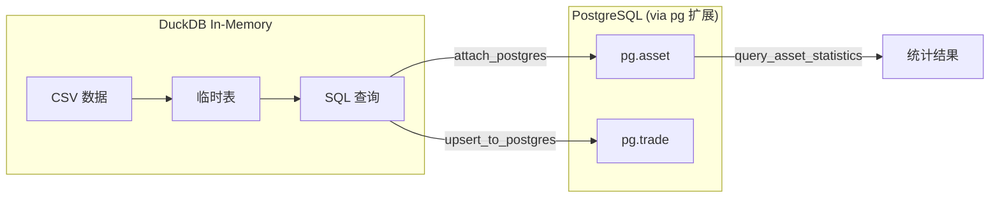
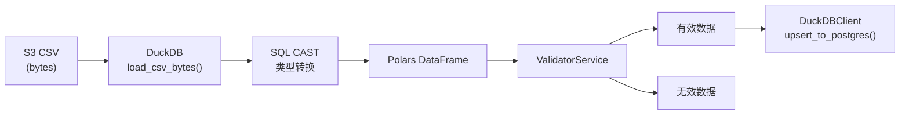

# 架构设计文档

## 1. 系统概览

Small ETL 是一个批量数据 ETL 系统，用于将 S3 CSV 文件中的资产和交易数据同步到 PostgreSQL 数据库，并提供数据验证和统计分析功能。

### 1.1 系统架构图


### 1.2 技术栈

| 层级 | 技术选型 | 用途 |
|------|----------|------|
| CLI | argparse | 命令行参数解析 |
| 任务调度 | APScheduler | 定时任务管理（PostgreSQL持久化） |
| 数据源 | MinIO/AWS S3 | CSV 文件存储 |
| 数据处理 | DuckDB + Polars | 内存数据转换、列式处理 |
| Schema验证 | Pandera | DataFrame 验证规则定义 |
| 目标数据库 | PostgreSQL | 持久化存储 |
| ORM/Schema | SQLModel | 数据模型定义 |
| 数据库迁移 | Alembic | Schema 版本管理 |
| 配置管理 | Hydra | 多环境配置管理 |
| 包管理 | pixi | 依赖和环境管理 |
| 测试框架 | pytest | 单元测试和集成测试 |
| 类型检查 | Pyright, Pyrefly | 静态类型检查 |
| 代码规范 | Ruff | Linting 和格式化 |

## 2. 分层架构

### 2.1 架构层次


### 2.2 各层职责

#### CLI Layer (命令行层)
- **参数解析**: 使用 argparse 解析命令行参数
- **命令分发**: 根据子命令调用不同的 Pipeline 方法
- **配置覆盖**: 支持通过命令行参数覆盖 Hydra 配置
- **结果输出**: 格式化输出执行结果和统计信息

#### Scheduler Layer (调度层)
- **ETLScheduler**: 基于 APScheduler 的定时任务调度器，支持 PostgreSQL 持久化
- **ScheduledJob**: 定时任务定义，包含任务ID、命令、调度规则
- **任务管理**: 支持添加、移除、暂停、恢复、列出定时任务
- **任务持久化**: 使用 SQLAlchemyJobStore 将任务存储在 PostgreSQL
- **调度模式**: 支持阻塞式（BlockingScheduler）和后台（BackgroundScheduler）运行

#### Application Layer (应用层)
- **ETLPipeline**: ETL 流程编排，支持完整流程或单独运行 assets/trades
- **PipelineResult**: 封装执行结果，包含验证结果、加载结果和统计信息
- 上下文管理器支持，自动资源清理

#### Service Layer (服务层)
- **ExtractorService**: 从 S3 提取 CSV，通过 DuckDB 转换为 Polars DataFrame
- **ValidatorService**: 字段级验证 + 业务规则验证，返回 ValidationResult
- **LoaderService**: 批量将 DataFrame 加载到 PostgreSQL
- **AnalyticsService**: 对有效数据进行统计分析

#### Data Access Layer (数据访问层)
- **S3Connector**: MinIO/S3 文件操作封装
- **DuckDBClient**: 内存数据库操作，CSV 加载和 SQL 查询
- **PostgresRepository**: 数据库 CRUD 操作，支持批量 UPSERT

#### Domain Layer (领域层)
- **数据模型**: Asset, Trade (SQLModel)
- **枚举类型**: AccountType, Direction, OffsetFlag (IntEnum)
- **验证Schema**: AssetSchema, TradeSchema (Pandera DataFrameModel)

## 3. 核心组件设计

### 3.1 CLI 组件


#### 3.1.1 命令行接口设计

**入口模块:** `src/small_etl/cli.py`

**支持的命令:**

```bash
# 完整 ETL 流程
pixi run python -m small_etl run

# 仅处理 Assets
pixi run python -m small_etl assets

# 仅处理 Trades
pixi run python -m small_etl trades

# 清空数据表 (truncate asset 和 trade 表)
pixi run python -m small_etl clean

# 定时任务管理
pixi run python -m small_etl schedule start|add|list|remove
```

**通用参数:**

| 参数 | 短选项 | 说明 | 默认值 |
|------|--------|------|--------|
| `--env` | `-e` | 环境配置 (dev/test) | dev |
| `--batch-size` | `-b` | 批处理大小 | 10000 |
| `--verbose` | `-v` | 详细输出 | False |
| `--dry-run` | | 仅验证不加载 | False |

**S3 参数覆盖:**

| 参数 | 说明 |
|------|------|
| `--s3-endpoint` | S3/MinIO 端点 |
| `--s3-bucket` | S3 bucket 名称 |
| `--assets-file` | Assets CSV 文件名 |
| `--trades-file` | Trades CSV 文件名 |

**数据库参数覆盖:**

| 参数 | 说明 |
|------|------|
| `--db-host` | 数据库主机 |
| `--db-port` | 数据库端口 |
| `--db-name` | 数据库名称 |
| `--db-user` | 数据库用户 |
| `--db-password` | 数据库密码 |

#### 3.1.2 接口定义

```python
def main() -> int:
    """CLI 入口函数，返回退出码"""
    ...

def parse_args(args: list[str] | None = None) -> argparse.Namespace:
    """解析命令行参数"""
    ...

def run_pipeline(args: argparse.Namespace) -> int:
    """执行 ETL Pipeline"""
    ...

def print_result(result: PipelineResult, verbose: bool = False) -> None:
    """格式化输出执行结果"""
    ...
```

#### 3.1.3 使用示例

```bash
# 使用测试环境配置
pixi run python -m small_etl.cli run --env test

# 自定义批处理大小和详细输出
pixi run python -m small_etl.cli run --batch-size 5000 --verbose

# 仅验证数据，不写入数据库
pixi run python -m small_etl.cli run --dry-run

# 覆盖 S3 配置
pixi run python -m small_etl.cli run --s3-bucket my-bucket --assets-file data.csv

# 覆盖数据库配置
pixi run python -m small_etl.cli run --db-host 192.168.1.100 --db-port 5432
```

#### 3.1.4 退出码

| 退出码 | 含义 |
|--------|------|
| 0 | 成功 |
| 1 | 一般错误 |
| 2 | 参数错误 |
| 3 | 连接错误 (S3/DB) |
| 4 | 验证错误 (有无效数据) |

#### 3.1.5 clean 命令

`clean` 命令用于清空数据库中的 asset 和 trade 表，方便测试时重置数据。

**参数:**

| 参数 | 短选项 | 说明 | 默认值 |
|------|--------|------|--------|
| `--env` | `-e` | 环境配置 (dev/test) | dev |
| `--verbose` | `-v` | 详细输出 | False |
| `--db-host` | | 数据库主机 | 配置文件 |
| `--db-port` | | 数据库端口 | 配置文件 |
| `--db-name` | | 数据库名称 | 配置文件 |
| `--db-user` | | 数据库用户 | 配置文件 |
| `--db-password` | | 数据库密码 | 配置文件 |

**使用示例:**

```bash
# 清空开发环境数据
pixi run python -m small_etl clean

# 清空测试环境数据
pixi run python -m small_etl clean --env test

# 清空指定数据库
pixi run python -m small_etl clean --db-host 192.168.1.100 --db-name mydb
```

### 3.2 Scheduler 组件


#### 3.2.1 ETLScheduler (调度器)

**职责:**
- 管理定时任务的生命周期
- 基于 APScheduler 实现调度，支持 CronTrigger 和 IntervalTrigger
- 使用 SQLAlchemyJobStore 将任务持久化到 PostgreSQL
- 支持任务的添加、移除、暂停、恢复、列出
- 调用 ETLPipeline 执行实际 ETL 操作

**接口:**
```python
@dataclass
class ScheduledJob:
    """定时任务定义"""
    job_id: str           # 任务唯一标识
    command: str          # ETL命令: run/assets/trades
    interval: str         # 调度间隔: day/hour/minute
    at_time: str | None   # 执行时间点: "02:00"
    enabled: bool         # 是否启用
    next_run: datetime | None  # 下次执行时间
    last_run: datetime | None  # 上次执行时间

class ETLScheduler:
    """ETL 定时任务调度器（基于 APScheduler）"""
    def __init__(self, config: dict[str, Any], blocking: bool = True): ...
    def add_job(self, job_id: str, command: str, interval: str, at_time: str | None = None) -> ScheduledJob: ...
    def remove_job(self, job_id: str) -> bool: ...
    def pause_job(self, job_id: str) -> bool: ...
    def resume_job(self, job_id: str) -> bool: ...
    def list_jobs(self) -> list[ScheduledJob]: ...
    def get_job(self, job_id: str) -> ScheduledJob | None: ...
    def start(self) -> None: ...  # 启动调度器
    def stop(self) -> None: ...
    @property
    def is_running(self) -> bool: ...
    @property
    def job_count(self) -> int: ...
```

**持久化机制:**
- 使用 `apscheduler.jobstores.sqlalchemy.SQLAlchemyJobStore`
- 自动在 PostgreSQL 中创建 `apscheduler_jobs` 表
- 任务在进程重启后自动恢复

#### 3.2.2 CLI schedule 子命令

**支持的操作:**

```bash
# 启动调度器（前台阻塞运行）
pixi run python -m small_etl schedule start

# 添加定时任务
pixi run python -m small_etl schedule add --job-id <id> --etl-command <cmd> --interval <interval> [--at <time>]

# 列出所有任务
pixi run python -m small_etl schedule list

# 移除任务
pixi run python -m small_etl schedule remove --job-id <id>

# 暂停任务
pixi run python -m small_etl schedule pause --job-id <id>

# 恢复任务
pixi run python -m small_etl schedule resume --job-id <id>
```

**参数说明:**

| 参数 | 说明 | 示例 |
|------|------|------|
| `--job-id` | 任务唯一标识符 | `daily_etl` |
| `--etl-command` | ETL 命令 (run/assets/trades) | `run` |
| `--interval` | 调度间隔 (day/hour/minute) | `day` |
| `--at` | 执行时间点 (仅 day 间隔有效) | `02:00` |

**使用示例:**

```bash
# 每天凌晨2点执行完整ETL
pixi run python -m small_etl schedule add --job-id daily_etl --etl-command run --interval day --at "02:00"

# 每小时执行assets同步
pixi run python -m small_etl schedule add --job-id hourly_assets --etl-command assets --interval hour

# 每分钟执行（测试用）
pixi run python -m small_etl schedule add --job-id test_job --etl-command run --interval minute
```

#### 3.2.3 调度配置

**配置文件:** `configs/scheduler/default.yaml`

```yaml
enabled: true
check_interval: 1  # 调度循环检查间隔（秒）
jobs:
  - job_id: daily_full_etl
    command: run
    interval: day
    at: "02:00"
    enabled: true
  - job_id: hourly_assets
    command: assets
    interval: hour
    enabled: true
```

### 3.3 ETL Pipeline 组件


#### 3.3.1 ExtractorService (提取器)

**职责:**
- 连接 S3/MinIO 存储
- 读取 CSV 文件为字节流
- 通过 DuckDB 或 Polars 加载并转换数据类型
- 返回 Polars DataFrame

**接口:**
```python
class ExtractorService:
    def __init__(self, s3_connector: S3Connector, duckdb_client: DuckDBClient, config: DictConfig | None = None): ...
    def extract_assets(self, bucket: str, object_name: str) -> pl.DataFrame: ...
    def extract_trades(self, bucket: str, object_name: str) -> pl.DataFrame: ...
```

**双模式提取实现:**

ExtractorService 支持两种提取模式，根据配置自动选择：

```python
def extract_assets(self, bucket: str, object_name: str) -> pl.DataFrame:
    csv_bytes = self._s3.download_csv(bucket, object_name)

    if self._config is not None and hasattr(self._config, "assets"):
        # 模式1: 配置驱动 - 使用 Polars + Hydra 列映射
        df = pl.read_csv(io.BytesIO(csv_bytes), has_header=True, infer_schema_length=10000)
        df = self._transform_dataframe(df, self._config.assets.columns)
        # 输出: "Extracted N asset records (config-driven)"
    else:
        # 模式2: DuckDB 自动型 - SQL 类型转换
        self._duckdb.load_csv_bytes(csv_bytes, "raw_assets")
        df = self._duckdb.query("""
            SELECT
                id,
                CAST(account_id AS VARCHAR) as account_id,
                account_type,
                CAST(cash AS DECIMAL(20, 2)) as cash,
                ...
            FROM raw_assets
        """)
        # 输出: "Extracted N asset records (DuckDB fallback)"
    return df
```

**配置驱动转换 (_transform_dataframe):**

```python
def _transform_dataframe(self, df: pl.DataFrame, columns_config: list[Any]) -> pl.DataFrame:
    """根据 Hydra 配置进行列转换"""
    expressions = []
    for col_cfg in columns_config:
        csv_name = col_cfg.csv_name    # CSV 中的原始列名
        target_name = col_cfg.name     # 目标列名
        dtype = col_cfg.dtype          # 目标数据类型

        if dtype == "Datetime":
            fmt = getattr(col_cfg, "format", "%Y-%m-%dT%H:%M:%S")
            expr = pl.col(csv_name).str.to_datetime(fmt).alias(target_name)
        elif dtype == "Float64":
            expr = pl.col(csv_name).cast(pl.Float64).alias(target_name)
        elif dtype == "Utf8":
            expr = pl.col(csv_name).cast(pl.Utf8).alias(target_name)
        elif dtype in ("Int32", "Int64"):
            expr = pl.col(csv_name).cast(getattr(pl, dtype)()).alias(target_name)
        else:
            expr = pl.col(csv_name).alias(target_name)
        expressions.append(expr)

    return df.select(expressions)
```

**模式选择条件:**
| 条件 | 选择模式 | 优势 |
|------|----------|------|
| `config` 包含 `assets`/`trades` 配置 | 配置驱动 (Polars) | 灵活的列映射和类型转换 |
| `config` 为空或无对应配置 | DuckDB 自动型 | 快速启动，自动类型推断 |

**Hydra 列映射配置示例 (`configs/extractor/default.yaml`):**

```yaml
assets:
  columns:
    - name: account_id        # 目标列名
      csv_name: account_id    # CSV 中的列名
      dtype: Utf8             # 目标类型
      nullable: false
    - name: cash
      csv_name: cash
      dtype: Float64
      nullable: false
    - name: updated_at
      csv_name: updated_at
      dtype: Datetime
      format: "%Y-%m-%dT%H:%M:%S%.f"  # 时间戳格式
      nullable: false

csv_options:
  delimiter: ","
  has_header: true
  encoding: "utf-8"
  null_values: ["", "NULL", "null", "None"]
```

#### 3.3.2 ValidatorService (验证器)

**职责:**
- 字段类型和范围验证
- 枚举值有效性检查
- 业务规则验证（金额计算公式）
- 可选的外键验证（trades 的 account_id）

**接口:**
```python
@dataclass
class ValidationResult:
    is_valid: bool
    valid_rows: pl.DataFrame
    invalid_rows: pl.DataFrame
    errors: list[ValidationError]
    total_rows: int
    valid_count: int
    invalid_count: int

class ValidatorService:
    def __init__(self, tolerance: float = 0.01): ...
    def validate_assets(self, df: pl.DataFrame) -> ValidationResult: ...
    def validate_trades(self, df: pl.DataFrame, valid_account_ids: set[str] | None = None) -> ValidationResult: ...
```

**验证规则:**
- **Asset**:
  - account_id 必填且唯一
  - account_type ∈ {1, 2, 3, 5, 6, 7, 11}
  - cash, frozen_cash, market_value, total_asset >= 0
  - total_asset = cash + frozen_cash + market_value (±0.01)
- **Trade**:
  - 所有字符串字段必填
  - traded_price, traded_volume, traded_amount > 0
  - direction ∈ {0, 48, 49}
  - offset_flag ∈ {48, 49, 50, 51, 52, 53, 54}
  - traded_amount = traded_price × traded_volume (±0.01)

#### 3.3.3 LoaderService (加载器)

**职责:**
- 将 Polars DataFrame 转换为模型实例
- 批量写入数据库
- 支持 UPSERT 操作（存在则更新，不存在则插入）

**接口:**
```python
@dataclass
class LoadResult:
    success: bool
    total_rows: int
    loaded_count: int
    failed_count: int = 0
    error_message: str | None = None

class LoaderService:
    def __init__(self, repository: PostgresRepository, duckdb_client: DuckDBClient, database_url: str): ...
    def load_assets(self, df: pl.DataFrame, batch_size: int = 10000) -> LoadResult: ...
    def load_trades(self, df: pl.DataFrame, batch_size: int = 10000) -> LoadResult: ...
```

**DuckDB PostgreSQL 插件 UPSERT 实现:**

LoaderService 使用 DuckDB 的 PostgreSQL 扩展进行高性能批量写入，采用 UPDATE + INSERT 分离策略：

```python
def upsert_to_postgres(self, df: pl.DataFrame, table_name: str, conflict_column: str) -> int:
    """使用 UPDATE + INSERT 模式处理外键约束"""
    if df.is_empty():
        return 0

    # 1. 注册 DataFrame 为 DuckDB 临时表
    temp_table = f"_temp_{table_name}"
    self._conn.register(temp_table, df.to_arrow())

    # 2. UPDATE 已存在的记录
    columns = df.columns
    update_columns = [c for c in columns if c != conflict_column]
    set_clause = ", ".join([f'{c} = t."{c}"' for c in update_columns])

    update_sql = f"""
        UPDATE pg.{table_name} AS p
        SET {set_clause}
        FROM {temp_table} AS t
        WHERE p.{conflict_column} = t."{conflict_column}"
    """
    self._conn.execute(update_sql)

    # 3. INSERT 新记录 (使用 NOT EXISTS 过滤已存在的)
    columns_str = ", ".join(columns)
    values_str = ", ".join([f'"{c}"' for c in columns])

    insert_sql = f"""
        INSERT INTO pg.{table_name} ({columns_str})
        SELECT {values_str} FROM {temp_table} t
        WHERE NOT EXISTS (
            SELECT 1 FROM pg.{table_name} p
            WHERE p.{conflict_column} = t."{conflict_column}"
        )
    """
    self._conn.execute(insert_sql)

    # 4. 清理临时表
    self._conn.unregister(temp_table)
    return len(df)
```

**为什么使用 UPDATE + INSERT 而非 ON CONFLICT:**

| 方案 | 问题 | 适用场景 |
|------|------|----------|
| `ON CONFLICT DO UPDATE` | 在有外键约束时可能产生死锁或约束冲突 | 简单表，无外键 |
| `UPDATE + INSERT 分离` | 分两步执行，先更新后插入，避免外键问题 | 有外键约束的表 |

本项目中 Trade 表有 `account_id` 外键指向 Asset 表，因此采用分离策略。

**批处理实现:**

```python
def load_assets(self, df: pl.DataFrame, batch_size: int = 10000) -> LoadResult:
    total_rows = len(df)
    loaded_count = 0

    for offset in range(0, total_rows, batch_size):
        batch = df.slice(offset, batch_size)  # Polars slice 切分批次
        count = self._duckdb.upsert_to_postgres(batch, "asset", "account_id")
        loaded_count += count

    return LoadResult(success=True, total_rows=total_rows, loaded_count=loaded_count)
```

**实现细节:**
- 使用 `df.slice(offset, length)` 进行批次切分，内存效率高
- Asset 表冲突键: `account_id`
- Trade 表冲突键: `traded_id`
- 批次大小默认 10,000，可通过 CLI 参数 `--batch-size` 调整

#### 3.3.4 AnalyticsService (统计分析)

**职责:**
- 计算汇总统计信息
- 按维度分组聚合

**接口:**
```python
@dataclass
class AssetStatistics:
    total_records: int
    total_cash: Decimal
    total_frozen_cash: Decimal
    total_market_value: Decimal
    total_assets: Decimal
    avg_cash: Decimal
    avg_total_asset: Decimal
    by_account_type: dict[int, dict[str, Any]]

@dataclass
class TradeStatistics:
    total_records: int
    total_volume: int
    total_amount: Decimal
    avg_price: Decimal
    avg_volume: float
    by_account_type: dict
    by_offset_flag: dict
    by_strategy: dict

class AnalyticsService:
    def asset_statistics(self, df: pl.DataFrame) -> AssetStatistics: ...
    def trade_statistics(self, df: pl.DataFrame) -> TradeStatistics: ...
```

**实现细节:**
- 用duckdb读取已入库的数据，再做简单的统计分析: 例如，账户资产平均值


### 3.4 数据模型设计

#### 3.4.1 枚举类型

```python
class AccountType(IntEnum):
    """账户类型"""
    FUTURE = 1          # 期货
    SECURITY = 2        # 证券
    CREDIT = 3          # 信用
    FUTURE_OPTION = 5   # 期货期权
    STOCK_OPTION = 6    # 股票期权
    HUGANGTONG = 7      # 沪港通
    SHENGANGTONG = 11   # 深港通

class Direction(IntEnum):
    """交易方向"""
    NA = 0      # 不适用
    LONG = 48   # 多/买
    SHORT = 49  # 空/卖

class OffsetFlag(IntEnum):
    """开平标志"""
    OPEN = 48            # 开仓
    CLOSE = 49           # 平仓
    FORCECLOSE = 50      # 强平
    CLOSETODAY = 51      # 平今
    CLOSEYESTERDAY = 52  # 平昨
    FORCEOFF = 53        # 强减
    LOCALFORCECLOSE = 54 # 本地强平
```

#### 3.4.2 Asset Model (资产表)

```python
class Asset(SQLModel, table=True):
    """资产表模型"""
    id: int | None = Field(default=None, primary_key=True)
    account_id: str = Field(unique=True, index=True, max_length=20)
    account_type: int = Field(index=True)
    cash: Decimal = Field(max_digits=20, decimal_places=2)
    frozen_cash: Decimal = Field(max_digits=20, decimal_places=2)
    market_value: Decimal = Field(max_digits=20, decimal_places=2)
    total_asset: Decimal = Field(max_digits=20, decimal_places=2)
    updated_at: datetime
```

#### 3.4.3 Trade Model (交易表)

```python
class Trade(SQLModel, table=True):
    """交易表模型"""
    id: int | None = Field(default=None, primary_key=True)
    account_id: str = Field(index=True, max_length=20, foreign_key="asset.account_id")
    account_type: int = Field(index=True)
    traded_id: str = Field(unique=True, index=True, max_length=50)
    stock_code: str = Field(index=True, max_length=10)
    traded_time: datetime
    traded_price: Decimal = Field(max_digits=20, decimal_places=2)
    traded_volume: int
    traded_amount: Decimal = Field(max_digits=20, decimal_places=2)
    strategy_name: str = Field(max_length=50)
    order_remark: str | None = Field(default=None, max_length=100)
    direction: int
    offset_flag: int
    created_at: datetime
    updated_at: datetime
```

#### 3.4.4 Pandera Schema (验证模式)

**常量定义 (`domain/schemas.py`):**

```python
# 浮点数验证容差
DEFAULT_TOLERANCE = 0.01
```

**AssetSchema 实现:**

```python
class AssetSchema(pa.DataFrameModel):
    """资产数据验证Schema"""
    account_id: str = pa.Field(str_length={"min_value": 1, "max_value": 20})
    account_type: int = pa.Field(isin=list(VALID_ACCOUNT_TYPES))
    cash: float = pa.Field(ge=0)
    frozen_cash: float = pa.Field(ge=0)
    market_value: float = pa.Field(ge=0)
    total_asset: float = pa.Field(ge=0)
    updated_at: pl.Datetime = pa.Field()

    class Config:
        strict = False  # 允许额外字段 (id, _original_index)
        coerce = True   # 自动类型转换

    @pa.dataframe_check
    @classmethod
    def total_asset_equals_sum(cls, data: PolarsData) -> pl.LazyFrame:
        """验证 total_asset = cash + frozen_cash + market_value (±0.01)"""
        return data.lazyframe.select(
            (pl.col("total_asset") - (pl.col("cash") + pl.col("frozen_cash") + pl.col("market_value")))
            .abs()
            .le(DEFAULT_TOLERANCE)
        )
```

**TradeSchema 实现:**

```python
class TradeSchema(pa.DataFrameModel):
    """交易数据验证Schema"""
    account_id: str = pa.Field(str_length={"min_value": 1, "max_value": 20})
    account_type: int = pa.Field(isin=list(VALID_ACCOUNT_TYPES))
    traded_id: str = pa.Field(str_length={"min_value": 1, "max_value": 50})
    stock_code: str = pa.Field(str_length={"min_value": 1, "max_value": 10})
    traded_time: pl.Datetime = pa.Field()
    traded_price: float = pa.Field(gt=0)
    traded_volume: int = pa.Field(gt=0)
    traded_amount: float = pa.Field(gt=0)
    strategy_name: str = pa.Field(str_length={"min_value": 1, "max_value": 50})
    order_remark: str = pa.Field(nullable=True)
    direction: int = pa.Field(isin=list(VALID_DIRECTIONS))
    offset_flag: int = pa.Field(isin=list(VALID_OFFSET_FLAGS))
    created_at: pl.Datetime = pa.Field()
    updated_at: pl.Datetime = pa.Field()

    class Config:
        strict = False
        coerce = True

    @pa.dataframe_check
    @classmethod
    def traded_amount_equals_product(cls, data: PolarsData) -> pl.LazyFrame:
        """验证 traded_amount = traded_price × traded_volume (±0.01)"""
        return data.lazyframe.select(
            (pl.col("traded_amount") - (pl.col("traded_price") * pl.col("traded_volume")))
            .abs()
            .le(DEFAULT_TOLERANCE)
        )
```

**`@pa.dataframe_check` 装饰器说明:**

| 特性 | 说明 |
|------|------|
| 参数类型 | `PolarsData` - Pandera 封装的 Polars 数据类型 |
| 返回类型 | `pl.LazyFrame` - 包含布尔值列，表示每行是否通过验证 |
| 访问方式 | `data.lazyframe` 获取 LazyFrame 进行列式计算 |
| 计算模式 | 使用 Polars 的懒执行，支持大数据集高效验证 |

**验证流程:**
```
DataFrame → Pandera Schema → 字段级验证 → @pa.dataframe_check → 有效/无效行分离
                              ↓
                         ValidationResult {
                           valid_rows: DataFrame,
                           invalid_rows: DataFrame,
                           errors: List[ValidationError]
                         }
```

### 3.5 配置管理架构

使用 Hydra 实现多环境配置:

```
configs/
├── config.yaml           # 主配置入口
├── db/
│   ├── dev.yaml          # 开发环境数据库
│   └── test.yaml         # 测试环境数据库
├── s3/
│   └── dev.yaml          # S3/MinIO 配置
├── etl/
│   └── default.yaml      # ETL 参数配置
├── extractor/
│   └── default.yaml      # CSV 列映射配置 (新增)
└── scheduler/
    └── default.yaml      # 调度器配置
```

**主配置 (config.yaml):**
```yaml
defaults:
  - db: dev
  - s3: dev
  - etl: default
  - extractor: default    # 新增: CSV 格式配置
  - scheduler: default
  - _self_

app:
  name: small_etl
  version: 0.1.0
  log_level: INFO
```

**数据库配置 (db/dev.yaml):**
```yaml
host: ${oc.env:DB_HOST,localhost}
port: ${oc.env:DB_PORT,15432}
database: ${oc.env:DB_NAME,etl_db}
user: ${oc.env:DB_USER,etl}
password: ${oc.env:DB_PASSWORD,etlpass}
url: postgresql://${db.user}:${db.password}@${db.host}:${db.port}/${db.database}
echo: false
```

**S3配置 (s3/dev.yaml):**
```yaml
endpoint: ${oc.env:S3_ENDPOINT,localhost:19000}
access_key: ${oc.env:S3_ACCESS_KEY,minioadmin}
secret_key: ${oc.env:S3_SECRET_KEY,minioadmin123}
secure: false
bucket: ${oc.env:S3_BUCKET,fake-data-for-training}
assets_file: account_assets.csv
trades_file: trades.csv
```

**ETL配置 (etl/default.yaml):**
```yaml
batch_size: 10000
validation:
  tolerance: 0.01
```

**Extractor配置 (extractor/default.yaml):**
```yaml
# CSV 列映射配置 - 定义 CSV 列与目标数据类型的对应关系
assets:
  columns:
    - name: account_id        # 目标列名
      csv_name: account_id    # CSV 原始列名
      dtype: Utf8             # Polars 数据类型
      nullable: false
    - name: cash
      csv_name: cash
      dtype: Float64
      nullable: false
    - name: updated_at
      csv_name: updated_at
      dtype: Datetime
      format: "%Y-%m-%dT%H:%M:%S%.f"
      nullable: false

trades:
  columns:
    - name: traded_id
      csv_name: traded_id
      dtype: Utf8
      nullable: false
    # ... 其他列配置

csv_options:
  delimiter: ","
  has_header: true
  encoding: "utf-8"
  null_values: ["", "NULL", "null", "None"]
```

### 3.6 DuckDB PostgreSQL 插件集成

ETL 系统使用 DuckDB 的 PostgreSQL 扩展实现高性能数据操作：



**初始化流程:**

```python
class ETLPipeline:
    def __init__(self, config: DictConfig) -> None:
        # 1. 创建 DuckDB 内存客户端
        self._duckdb = DuckDBClient()

        # 2. 安装并加载 postgres 扩展，附加 PostgreSQL 数据库
        self._duckdb.attach_postgres(config.db.url)
        # 执行: INSTALL postgres; LOAD postgres;
        # 执行: ATTACH 'postgresql://...' AS pg (TYPE POSTGRES)
```

**attach_postgres 实现:**

```python
def attach_postgres(self, database_url: str) -> None:
    if self._pg_attached:
        return

    # 安装并加载 postgres 扩展
    self._conn.execute("INSTALL postgres")
    self._conn.execute("LOAD postgres")

    # 附加 PostgreSQL 数据库，别名为 'pg'
    self._conn.execute(f"ATTACH '{database_url}' AS pg (TYPE POSTGRES)")
    self._pg_attached = True
```

**通过 DuckDB 查询 PostgreSQL 数据:**

```python
def query_asset_statistics(self) -> dict[str, Any]:
    """通过 DuckDB 直接查询 PostgreSQL 中的数据"""
    overall_sql = """
        SELECT
            COUNT(*) as total_records,
            COALESCE(SUM(cash), 0) as total_cash,
            COALESCE(SUM(total_asset), 0) as total_assets,
            COALESCE(AVG(total_asset), 0) as avg_total_asset
        FROM pg.asset  -- 直接查询 PostgreSQL 表
    """
    overall = self._conn.execute(overall_sql).fetchone()

    # 按 account_type 分组统计
    by_type_sql = """
        SELECT account_type, COUNT(*), SUM(total_asset), AVG(total_asset)
        FROM pg.asset
        GROUP BY account_type
    """
    # ...
```

**统计分析使用 DuckDB 的优势:**

| 特性 | 说明 |
|------|------|
| **跨数据源查询** | 同时访问内存数据 (Polars) 和远程数据库 (PostgreSQL) |
| **高性能聚合** | DuckDB 的列式引擎优化复杂聚合计算 |
| **减少数据传输** | 统计计算在 DuckDB 侧完成，只传输结果 |
| **统一 SQL 接口** | 使用标准 SQL 完成数据加载和分析 |

## 4. 数据流设计

### 4.1 完整数据流


### 4.2 数据转换流程



### 4.3 批处理流程

为处理大文件，采用批处理策略:

```
Polars DataFrame (N rows)
     │
     ├─▶ Batch 1 (rows 0 - 9999)
     │        │
     │        └─▶ duckdb.upsert_to_postgres()
     │
     ├─▶ Batch 2 (rows 10000 - 19999)
     │        │
     │        └─▶ duckdb.upsert_to_postgres()
     │
     └─▶ Batch N ...
              │
              └─▶ ...
```

- 默认批量大小: 10,000 行/批次
- 使用 `df.slice(offset, length)` 切分

## 5. 错误处理策略

### 5.1 错误分类

| 错误类型 | 处理策略 | 示例 |
|----------|----------|------|
| 连接错误 | 抛出异常，Pipeline 终止 | S3 连接失败、DB 连接失败 |
| 验证错误 | 记录到 ValidationResult.errors，继续处理有效行 | 字段类型错误、业务规则违反 |
| 加载错误 | 返回 LoadResult.success=False | 数据库写入失败 |

### 5.2 ValidationError 结构

```python
@dataclass
class ValidationError:
    row_index: int      # 错误行索引
    field: str          # 错误字段名
    message: str        # 错误描述
    value: str | None   # 错误值
```

### 5.3 验证结果处理

- 有效行和无效行分离: `valid_rows` / `invalid_rows`
- 统计信息: `total_rows`, `valid_count`, `invalid_count`
- 只有有效行会被加载到数据库
- 只有有效行会参与统计分析

## 6. 性能优化设计

### 6.1 批量处理

- 批量大小: 10,000 行/批次 (可配置)
- 使用 Polars 列式处理，高效内存使用
- DuckDB 内存数据库，快速 SQL 查询

### 6.2 数据库优化

**PostgreSQL 优化:**
- 批量 UPSERT: 按主键查询后批量更新/插入
- 索引策略:
  - 主键: `id` (自增)
  - 唯一索引: `account_id` (Asset), `traded_id` (Trade)
  - 普通索引: `account_type`, `stock_code`
- SQLModel Session 管理

**DuckDB 优化:**
- 内存数据库模式 (`:memory:`)
- SQL 类型转换: `CAST(field AS DECIMAL(20,2))`
- 直接导出为 Polars DataFrame

### 6.3 数据转换

- 使用 DuckDB `upsert_to_postgres()` 直接写入数据库
- Decimal 精度处理: 模型中使用 Decimal，DataFrame 中使用 float
- None/null 值处理: 可选字段默认 None

## 7. 测试架构

### 7.1 测试结构

```
tests/
├── conftest.py              # 共享 fixtures
├── unit/                    # 单元测试 (无外部依赖)
│   ├── test_analytics.py    # AnalyticsService 测试
│   ├── test_duckdb.py       # DuckDBClient 测试
│   ├── test_models.py       # 数据模型测试
│   ├── test_pipeline.py     # Pipeline 测试
│   └── test_validator.py    # ValidatorService 测试
└── integration/             # 集成测试 (需要 PostgreSQL)
    └── test_full_pipeline.py
```

### 7.2 测试 Fixtures

```python
# tests/conftest.py
@pytest.fixture
def test_db_engine():
    """测试数据库引擎 - 自动创建数据库"""
    ...

@pytest.fixture
def test_db_session(test_db_engine):
    """测试数据库 Session"""
    ...

@pytest.fixture
def sample_asset_data() -> pl.DataFrame:
    """有效资产数据样本"""
    ...

@pytest.fixture
def sample_trade_data() -> pl.DataFrame:
    """有效交易数据样本"""
    ...

@pytest.fixture
def invalid_asset_data() -> pl.DataFrame:
    """无效资产数据样本 (用于验证测试)"""
    ...

@pytest.fixture
def invalid_trade_data() -> pl.DataFrame:
    """无效交易数据样本"""
    ...
```

### 7.3 运行测试

```bash
# 单元测试
pixi run pytest tests/unit/ -v --no-cov

# 集成测试 (需要 PostgreSQL)
pixi run pytest tests/integration/ -v --no-cov

# 单个测试
pixi run pytest tests/unit/test_validator.py::TestValidatorService::test_validate_valid_assets -v --no-cov
```

## 8. 安全设计

### 8.1 配置安全

- 敏感信息使用环境变量: `${oc.env:VAR_NAME,default}`
- 不在代码中硬编码密码
- 支持环境变量覆盖默认配置

```yaml
# Hydra 环境变量语法
host: ${oc.env:DB_HOST,localhost}
password: ${oc.env:DB_PASSWORD,etlpass}
```

### 8.2 数据库权限

- 使用专用数据库用户
- 最小权限原则

## 9. 目录结构总览

```
src/small_etl/
├── __init__.py              # 包导出: ETLPipeline, Asset, Trade, 枚举, 结果类
├── __main__.py              # python -m small_etl 入口
├── cli.py                   # CLI 入口: main(), parse_args(), run_pipeline()
├── domain/
│   ├── __init__.py          # 导出 models, enums, schemas
│   ├── models.py            # Asset, Trade (SQLModel)
│   ├── enums.py             # AccountType, Direction, OffsetFlag (IntEnum)
│   └── schemas.py           # AssetSchema, TradeSchema (Pandera)
├── data_access/
│   ├── __init__.py
│   ├── s3_connector.py      # S3Connector (MinIO 客户端)
│   ├── duckdb_client.py     # DuckDBClient (内存数据库)
│   ├── postgres_repository.py  # PostgresRepository
│   └── db_setup.py          # 数据库初始化工具
├── services/
│   ├── __init__.py
│   ├── extractor.py         # ExtractorService
│   ├── validator.py         # ValidatorService, ValidationResult, ValidationError
│   ├── loader.py            # LoaderService, LoadResult
│   └── analytics.py         # AnalyticsService, AssetStatistics, TradeStatistics
├── scheduler/                   # 新增: 调度模块
│   ├── __init__.py
│   └── scheduler.py         # ETLScheduler, ScheduledJob
├── application/
│   ├── __init__.py
│   └── pipeline.py          # ETLPipeline, PipelineResult
└── config/
    └── __init__.py          # 配置工具 (预留)
```

## 10. 关键技术决策

| 决策点 | 选择 | 理由 |
|--------|------|------|
| CLI | argparse | 标准库，无额外依赖，功能完整 |
| 任务调度 | APScheduler | 成熟的Python调度库，支持多种触发器，内置PostgreSQL持久化 |
| 数据处理 | DuckDB + Polars | 高性能内存处理，列式存储优化 |
| 验证框架 | Pandera Schema + 自定义验证 | Schema 定义清晰，验证逻辑灵活 |
| ORM | SQLModel | 类型安全，Pydantic 集成 |
| 配置管理 | Hydra | 多环境配置，环境变量支持 |
| 包管理 | pixi | 现代化包管理，跨平台 |
| 数据库迁移 | Alembic | SQLModel 官方推荐 |
| 类型检查 | Pyright + Pyrefly | 严格类型检查，多工具验证 |
| 代码规范 | Ruff | 快速 linting，替代 flake8/black |

## 11. 使用示例

### 11.1 CLI 命令行使用

```bash
# 完整 ETL 流程
pixi run python -m small_etl run

# 使用测试环境
pixi run python -m small_etl run --env test

# 仅处理 Assets
pixi run python -m small_etl assets

# 仅处理 Trades
pixi run python -m small_etl trades

# 清空数据表
pixi run python -m small_etl clean

# 清空测试环境数据表
pixi run python -m small_etl clean --env test

# 自定义参数
pixi run python -m small_etl run --batch-size 5000 --verbose

# 仅验证不加载
pixi run python -m small_etl run --dry-run

# 覆盖 S3 配置
pixi run python -m small_etl run --s3-bucket my-bucket --assets-file custom.csv

# 覆盖数据库配置
pixi run python -m small_etl run --db-host 192.168.1.100 --db-port 5432
```

### 11.2 Python 脚本调用

```python
from hydra import compose, initialize
from small_etl import ETLPipeline

# 初始化配置
with initialize(config_path="../configs"):
    config = compose(config_name="config")

# 运行 ETL
with ETLPipeline(config) as pipeline:
    result = pipeline.run()

    if result.success:
        print(f"Assets: {result.assets_load.loaded_count}")
        print(f"Trades: {result.trades_load.loaded_count}")
    else:
        print(f"Error: {result.error_message}")
```

### 11.3 单独运行 Assets 或 Trades

```python
# 只处理 Assets
result = pipeline.run_assets_only()

# 只处理 Trades (需要 Assets 已加载)
result = pipeline.run_trades_only()
```

### 11.4 数据库初始化

```bash
# 创建测试数据库
pixi run python -m small_etl.data_access.db_setup

# 运行 Alembic 迁移
ETL_ENV=test pixi run alembic upgrade head
```

### 11.5 定时任务

```bash
# 启动调度器（前台阻塞运行）
pixi run python -m small_etl schedule start

# 添加每天凌晨2点执行完整ETL
pixi run python -m small_etl schedule add --job-id daily_etl --etl-command run --interval day --at "02:00"

# 添加每小时执行assets同步
pixi run python -m small_etl schedule add --job-id hourly_assets --etl-command assets --interval hour

# 查看所有定时任务
pixi run python -m small_etl schedule list

# 暂停任务
pixi run python -m small_etl schedule pause --job-id daily_etl

# 恢复任务
pixi run python -m small_etl schedule resume --job-id daily_etl

# 移除任务
pixi run python -m small_etl schedule remove --job-id daily_etl
```

**注意:** 任务存储在 PostgreSQL 中，进程重启后任务会自动恢复。
