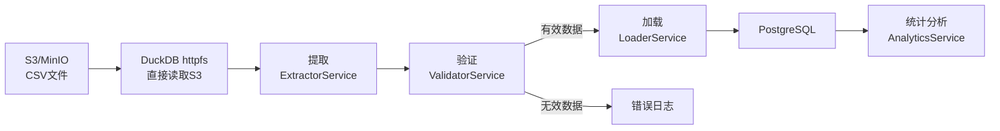

# 产品引导文档

## 项目目标
- 搭建一个 ETL 系统，实现从 S3 CSV 文件到 PostgreSQL 数据库的同步入库
- 目标数据表：
  - 资产表 (asset表)
  - 交易表 (trade表)
- 实现数据提取、验证、入库、统计分析全流程
- 提供可重复执行、可测试、可扩展的数据管道

## 目标用户
- 主要用户：量化研究员 / 数据工程师
- 使用方式：Python 脚本，支持命令行参数输入
- 使用场景：测试和优化 ETL 管道

## 数据流概述



**数据处理顺序：** Assets 必须先于 Trades 处理（外键约束：Trade.account_id → Asset.account_id）

## 核心功能

### 1. 数据提取
- DuckDB 通过 httpfs 扩展直接从 S3 读取 CSV 文件
- 支持 Hydra 配置驱动的列映射和类型转换（`configs/extractor/default.yaml`）
- 智能类型转换：自动检测列类型，避免重复转换

### 2. 数据验证
- **字段级验证**：Pandera Schema 定义类型、范围、枚举值
- **业务规则验证**：
  - Asset: `total_asset = cash + frozen_cash + market_value (±0.01)`
  - Trade: `traded_amount = traded_price × traded_volume (±0.01)`
- **外键验证**：Trade 的 account_id 必须存在于已加载的 Asset 中
- **结果分离**：有效数据入库，无效数据记录到错误日志

### 3. 数据入库
- 使用 DuckDB PostgreSQL 插件进行批量 UPSERT
- UPDATE + INSERT 分离策略，避免外键约束问题
- 默认批次大小：10,000 行

### 4. 数据分析
- 用 DuckDB 直接查询 PostgreSQL 中的已入库数据
- 支持多维度聚合：按账户类型、策略、开平标志分组

### 5. 命令行界面
- 支持 run/assets/trades/clean/schedule 命令
- 环境切换：`--env dev|test`
- 参数覆盖：`--batch-size`、`--db-host` 等

### 6. 定时任务管理
- APScheduler 支持周期性 ETL 执行
- 任务持久化到 PostgreSQL
- 支持添加、移除、暂停、恢复任务

### 7. Schema 管理
- SQLModel 定义数据模型
- Alembic 管理数据库迁移

### 8. 配置管理
- Hydra 多环境配置（dev/test）
- 支持环境变量覆盖

### 9. 自动化测试
- pytest 管理单元测试和集成测试
- Podman 容器自动化（PostgreSQL、MinIO）

## CLI 命令示例

```bash
# 完整 ETL 流程
pixi run python -m small_etl run

# 使用测试环境
pixi run python -m small_etl run --env test

# 仅处理 Assets
pixi run python -m small_etl assets

# 仅处理 Trades
pixi run python -m small_etl trades

# 清空数据表
pixi run python -m small_etl clean

# 仅验证不加载
pixi run python -m small_etl run --dry-run

# 自定义批处理大小
pixi run python -m small_etl run --batch-size 5000

# 定时任务管理
pixi run python -m small_etl schedule start
pixi run python -m small_etl schedule add --job-id daily_etl --etl-command run --interval day --at "02:00"
pixi run python -m small_etl schedule list
```

## 输出结果说明

### PipelineResult 结构

```python
@dataclass
class PipelineResult:
    success: bool                           # 是否成功
    started_at: datetime                    # 开始时间
    completed_at: datetime                  # 完成时间
    assets_validation: ValidationResult     # 资产验证结果
    trades_validation: ValidationResult     # 交易验证结果
    assets_load: LoadResult                 # 资产加载结果
    trades_load: LoadResult                 # 交易加载结果
    assets_stats: AssetStatistics | None    # 资产统计
    trades_stats: TradeStatistics | None    # 交易统计
    error_message: str | None               # 错误信息
```

### ValidationResult 结构

```python
@dataclass
class ValidationResult:
    is_valid: bool              # 是否全部有效
    valid_rows: pl.DataFrame    # 有效数据
    invalid_rows: pl.DataFrame  # 无效数据
    errors: list[ValidationError]  # 错误详情
    total_rows: int             # 总行数
    valid_count: int            # 有效行数
    invalid_count: int          # 无效行数
```

### 统计信息示例

```python
AssetStatistics:
  total_records: 1000
  total_cash: 50000000.00
  total_assets: 150000000.00
  avg_total_asset: 150000.00
  by_account_type: {
    2: {"count": 600, "sum_total": 90000000.00, "avg_total": 150000.00},  # 股票账户
    3: {"count": 200, "sum_total": 30000000.00, "avg_total": 150000.00},  # 信用账户
    1: {"count": 200, "sum_total": 30000000.00, "avg_total": 150000.00},  # 期货账户
  }

TradeStatistics:
  total_records: 5000
  total_volume: 500000
  total_amount: 25000000.00
  avg_price: 50.00
  by_account_type: {...}
  by_offset_flag: {48: {...}, 49: {...}}  # 买入/卖出
  by_strategy: {"策略A": {...}, "量化1号": {...}}
```

## 明确不做
- 不处理高频交易和实时流数据
- 不开发 Web 前端或 GUI
- 不直接对接外部交易系统

## 产品原则

### 1. 准确性优先
- 宁可慢一点，也要确保数据完全正确
- 有效/无效数据分离，不丢弃任何数据

### 2. 可配置性
- 提供灵活的配置选项
- 支持不同的数据源和目标格式
- 避免硬编码

### 3. 可测试性
- 重要功能需要有单元测试
- 集成测试使用 Podman 容器自动化

### 4. 可维护性
- 代码结构清晰，模块化
- 完善的文档和注释
- 遵循 Python 最佳实践
