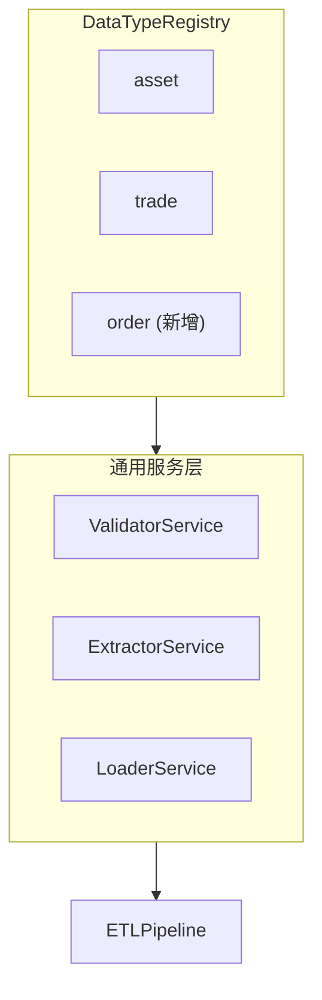

# 可扩展性指南

本文档说明如何扩展 Small ETL 系统以支持新的数据类型。以添加 `order`（订单）表为例，详细描述扩展步骤。

## 架构设计

系统采用 **DataTypeRegistry** 注册中心模式，实现数据类型的可插拔扩展：



**核心理念**：服务层代码无需修改，只需注册新的数据类型配置即可自动支持新表。

## 扩展步骤概览

添加新数据类型需要完成以下 6 个步骤：

| 步骤 | 文件 | 说明 |
|------|------|------|
| 1 | `domain/models.py` | 定义 SQLModel 模型 |
| 2 | `domain/schemas.py` | 定义 Pandera 验证 Schema |
| 3 | `domain/registry.py` | 注册数据类型配置 |
| 4 | `configs/extractor/default.yaml` | 配置列映射 |
| 5 | `configs/s3/dev.yaml` | 配置 S3 文件路径 |
| 6 | `configs/pipeline/default.yaml` | 添加处理步骤 |

可选步骤：
- 数据库迁移（Alembic）
- 添加统计分析方法
- 编写单元测试

---

## 详细步骤

### 步骤 1：定义 SQLModel 模型

**文件**: `src/small_etl/domain/models.py`

```python
class Order(SQLModel, table=True):
    """Order model representing trading orders.

    Attributes:
        id: Primary key, auto-generated.
        account_id: Account identifier (foreign key to Asset).
        order_id: Unique order identifier.
        stock_code: Stock/security code.
        order_price: Order price.
        order_volume: Order quantity.
        order_amount: Total order amount (price * volume).
        order_status: Order status (0=pending, 1=partial, 2=filled, 3=cancelled).
        order_time: Order submission timestamp.
        created_at: Record creation timestamp.
        updated_at: Last update timestamp.
    """

    id: Optional[int] = Field(default=None, primary_key=True)
    account_id: str = Field(index=True, max_length=20, foreign_key="asset.account_id")
    order_id: str = Field(unique=True, index=True, max_length=50)
    stock_code: str = Field(index=True, max_length=10)
    order_price: Decimal = Field(max_digits=20, decimal_places=2)
    order_volume: int
    order_amount: Decimal = Field(max_digits=20, decimal_places=2)
    order_status: int = Field(index=True)
    order_time: datetime
    created_at: datetime
    updated_at: datetime
```

**关键点**：
- 使用 `Decimal` 类型处理金额字段
- 定义外键关系 `foreign_key="asset.account_id"`
- 设置唯一键 `order_id` 用于 UPSERT

---

### 步骤 2：定义 Pandera 验证 Schema

**文件**: `src/small_etl/domain/schemas.py`

```python
# 在文件顶部添加订单状态有效值
VALID_ORDER_STATUSES = frozenset({0, 1, 2, 3})  # pending, partial, filled, cancelled


class OrderSchema(pa.DataFrameModel):
    """Pandera schema for Order data validation.

    Validates:
        - Required fields presence
        - Price and amount > 0
        - Volume > 0
        - Order status in valid range
        - order_amount = order_price * order_volume
    """

    account_id: str = pa.Field(str_length={"min_value": 1, "max_value": 20})
    order_id: str = pa.Field(str_length={"min_value": 1, "max_value": 50})
    stock_code: str = pa.Field(str_length={"min_value": 1, "max_value": 10})
    order_price: pl.Decimal(20, 2) = pa.Field(gt=0)  # type: ignore[valid-type]
    order_volume: int = pa.Field(gt=0)
    order_amount: pl.Decimal(20, 2) = pa.Field(gt=0)  # type: ignore[valid-type]
    order_status: int = pa.Field(isin=list(VALID_ORDER_STATUSES))
    order_time: pl.Datetime = pa.Field()
    created_at: pl.Datetime = pa.Field()
    updated_at: pl.Datetime = pa.Field()

    class Config:  # type: ignore[override]
        strict = False
        coerce = False

    @pa.dataframe_check  # type: ignore[misc]
    @classmethod
    def order_amount_equals_product(cls, data: PolarsData) -> pl.LazyFrame:
        """Check that order_amount = order_price * order_volume."""
        return data.lazyframe.select(
            pl.col("order_amount") == (pl.col("order_price") * pl.col("order_volume"))
        )
```

**关键点**：
- 使用 `@pa.dataframe_check` 定义业务规则验证
- `strict = False` 允许额外字段
- `coerce = False` 保持 Decimal 精度

---

### 步骤 3：注册数据类型配置

**文件**: `src/small_etl/domain/registry.py`

在 `_register_default_types()` 函数中添加：

```python
def _register_default_types() -> None:
    """Register default data types (Asset, Trade, Order)."""
    from small_etl.domain.models import Asset, Trade, Order
    from small_etl.domain.schemas import AssetSchema, TradeSchema, OrderSchema

    # ... 现有 Asset 和 Trade 注册代码 ...

    # Order configuration (新增)
    DataTypeRegistry.register(
        DataTypeConfig(
            name="order",                          # 数据类型名称
            table_name="order",                    # PostgreSQL 表名
            unique_key="order_id",                 # UPSERT 冲突检测列
            db_columns=[                           # 数据库列列表
                "account_id",
                "order_id",
                "stock_code",
                "order_price",
                "order_volume",
                "order_amount",
                "order_status",
                "order_time",
                "created_at",
                "updated_at",
            ],
            s3_file_key="orders_file",             # S3 配置键名
            raw_table_name="raw_orders",           # DuckDB 临时表名
            model_class=Order,                     # SQLModel 模型类
            schema_class=OrderSchema,              # Pandera Schema 类
            foreign_key_column="account_id",       # 外键列
            foreign_key_reference="asset",         # 外键引用的数据类型
            statistics_config={                    # 统计配置
                "aggregates": {
                    "order_volume": ["sum", "avg"],
                    "order_amount": ["sum"],
                },
                "group_by": ["order_status", "stock_code"],
            },
        )
    )
```

**DataTypeConfig 字段说明**：

| 字段 | 说明 |
|------|------|
| `name` | 数据类型唯一标识，用于 pipeline 配置引用 |
| `table_name` | PostgreSQL 目标表名 |
| `unique_key` | UPSERT 操作的冲突检测列 |
| `db_columns` | 需要写入数据库的列列表 |
| `s3_file_key` | S3 配置中的文件路径键名 |
| `model_class` | SQLModel 模型类引用 |
| `schema_class` | Pandera Schema 类引用 |
| `foreign_key_column` | 外键列名（可选） |
| `foreign_key_reference` | 外键引用的数据类型（可选） |

---

### 步骤 4：配置列映射

**文件**: `configs/extractor/default.yaml`

添加 orders 配置：

```yaml
orders:
  columns:
    - name: account_id
      csv_name: account_id
      dtype: Utf8
      nullable: false
    - name: order_id
      csv_name: order_id
      dtype: Utf8
      nullable: false
    - name: stock_code
      csv_name: stock_code
      dtype: Utf8
      nullable: false
    - name: order_price
      csv_name: order_price
      dtype: Decimal
      precision: 20
      scale: 2
      nullable: false
    - name: order_volume
      csv_name: order_volume
      dtype: Int64
      nullable: false
    - name: order_amount
      csv_name: order_amount
      dtype: Decimal
      precision: 20
      scale: 2
      nullable: false
    - name: order_status
      csv_name: order_status
      dtype: Int32
      nullable: false
    - name: order_time
      csv_name: order_time
      dtype: Datetime
      format: "%Y-%m-%dT%H:%M:%S%.f"
      nullable: false
    - name: created_at
      csv_name: created_at
      dtype: Datetime
      format: "%Y-%m-%dT%H:%M:%S%.f"
      nullable: false
    - name: updated_at
      csv_name: updated_at
      dtype: Datetime
      format: "%Y-%m-%dT%H:%M:%S%.f"
      nullable: false
```

**支持的数据类型**：
- `Utf8` - 字符串
- `Int32`, `Int64` - 整数
- `Float64` - 浮点数
- `Decimal` - 精确小数（需指定 precision 和 scale）
- `Datetime` - 日期时间（需指定 format）

---

### 步骤 5：配置 S3 文件路径

**文件**: `configs/s3/dev.yaml`

```yaml
endpoint: ${oc.env:S3_ENDPOINT,localhost:19000}
access_key: ${oc.env:S3_ACCESS_KEY,minioadmin}
secret_key: ${oc.env:S3_SECRET_KEY,minioadmin123}
secure: false
bucket: ${oc.env:S3_BUCKET,fake-data-for-training}
assets_file: account_assets.csv
trades_file: trades.csv
orders_file: orders.csv    # 新增
```

---

### 步骤 6：添加处理步骤

**文件**: `configs/pipeline/default.yaml`

```yaml
steps:
  - data_type: asset
    enabled: true
  - data_type: trade
    enabled: true
  - data_type: order      # 新增
    enabled: true

compute_analytics: true
```

**处理顺序**：步骤按配置顺序执行。由于 order 有外键引用 asset，必须确保 asset 在 order 之前处理。

---

## 可选步骤

### 数据库迁移

使用 Alembic 创建迁移脚本：

```bash
# 生成迁移脚本
pixi run alembic revision --autogenerate -m "add order table"

# 执行迁移
pixi run alembic upgrade head

# 测试环境迁移
ETL_ENV=test pixi run alembic upgrade head
```

### 添加统计分析

**文件**: `src/small_etl/data_access/duckdb_client.py`

```python
def query_order_statistics(self) -> dict[str, Any]:
    """Query order statistics from PostgreSQL via DuckDB."""
    if not self._pg_attached:
        raise RuntimeError("PostgreSQL not attached.")

    overall_sql = """
        SELECT
            COUNT(*) as total_records,
            COALESCE(SUM(order_volume), 0) as total_volume,
            COALESCE(SUM(order_amount), 0) as total_amount,
            COALESCE(AVG(order_price), 0) as avg_price
        FROM pg.order
    """
    overall = self._conn.execute(overall_sql).fetchone()

    by_status_sql = """
        SELECT order_status, COUNT(*), SUM(order_amount)
        FROM pg.order
        GROUP BY order_status
    """
    by_status_rows = self._conn.execute(by_status_sql).fetchall()

    by_status = {row[0]: {"count": row[1], "sum_amount": row[2]} for row in by_status_rows}

    return {
        "total_records": overall[0],
        "total_volume": overall[1],
        "total_amount": overall[2],
        "avg_price": overall[3],
        "by_status": by_status,
    }
```

**文件**: `src/small_etl/services/analytics.py`

```python
def order_statistics_from_db(self) -> dict[str, Any]:
    """Get order statistics from database."""
    return self._duckdb.query_order_statistics()
```

### 更新 Pipeline 统计计算

**文件**: `src/small_etl/application/pipeline.py`

在 `_compute_statistics` 方法中添加：

```python
def _compute_statistics(self, data_type: str) -> Any:
    if data_type == "asset":
        return self._analytics.asset_statistics_from_db()
    elif data_type == "trade":
        return self._analytics.trade_statistics_from_db()
    elif data_type == "order":
        return self._analytics.order_statistics_from_db()
    return None
```

### 更新类型转换逻辑

**文件**: `src/small_etl/services/validator.py`

在 `_convert_types` 方法中添加 order 类型处理：

```python
def _convert_types(self, df: pl.DataFrame, data_type: str) -> pl.DataFrame:
    if data_type == "asset":
        # ... 现有代码 ...
    elif data_type == "trade":
        # ... 现有代码 ...
    elif data_type == "order":
        exprs = [
            pl.col("account_id").cast(pl.Utf8),
            pl.col("order_id").cast(pl.Utf8),
            pl.col("stock_code").cast(pl.Utf8),
            pl.col("order_price").cast(pl.Decimal(20, 2)),
            pl.col("order_amount").cast(pl.Decimal(20, 2)),
        ]
        for col in ["order_time", "created_at", "updated_at"]:
            if df.schema.get(col) == pl.Utf8:
                exprs.append(pl.col(col).str.to_datetime())
        return df.with_columns(exprs)
    return df
```

---

## 测试验证

### 运行 ETL

```bash
# 运行完整 ETL（包含新的 order 步骤）
pixi run python -m small_etl

# 查看处理结果
pixi run python -c "
from hydra import compose, initialize
from small_etl import ETLPipeline

with initialize(config_path='../configs'):
    config = compose(config_name='config')

with ETLPipeline(config) as pipeline:
    result = pipeline.run()
    for step in result.step_results:
        print(f'{step.data_type}: {step.loaded_count} records')
"
```

### 单独处理 Order

```python
with ETLPipeline(config) as pipeline:
    result = pipeline.run(data_types=["order"])
```

---

## 扩展性设计要点

### 1. 零代码修改服务层

通过 DataTypeRegistry 注册机制，以下服务无需修改即可支持新数据类型：

- `ValidatorService.validate()` - 自动使用注册的 Schema
- `ExtractorService.transform()` - 自动使用注册的列配置
- `LoaderService.load()` - 自动使用注册的表名和唯一键

### 2. 配置驱动

所有数据类型特定的逻辑都通过配置定义：

```
DataTypeConfig (代码) + extractor.yaml (配置) + pipeline.yaml (配置)
```

### 3. 外键处理

系统自动处理外键验证：

1. Pipeline 按 `steps` 顺序执行
2. 如果数据类型有 `foreign_key_reference`，自动查询引用表的有效值
3. 验证时检查外键是否存在

### 4. 向后兼容

现有的 asset 和 trade 处理逻辑完全不受影响，新增数据类型是增量操作。

---

## 检查清单

添加新数据类型时，确保完成以下项目：

- [ ] 定义 SQLModel 模型 (`domain/models.py`)
- [ ] 定义 Pandera Schema (`domain/schemas.py`)
- [ ] 注册 DataTypeConfig (`domain/registry.py`)
- [ ] 配置列映射 (`configs/extractor/default.yaml`)
- [ ] 配置 S3 文件路径 (`configs/s3/dev.yaml`)
- [ ] 添加 pipeline 步骤 (`configs/pipeline/default.yaml`)
- [ ] 执行数据库迁移 (`alembic upgrade head`)
- [ ] 添加类型转换逻辑 (`services/validator.py` 的 `_convert_types`)
- [ ] 添加统计分析方法（可选）
- [ ] 编写单元测试
- [ ] 更新文档
